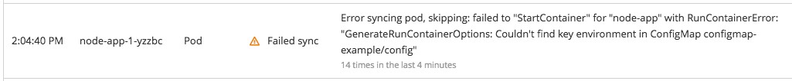
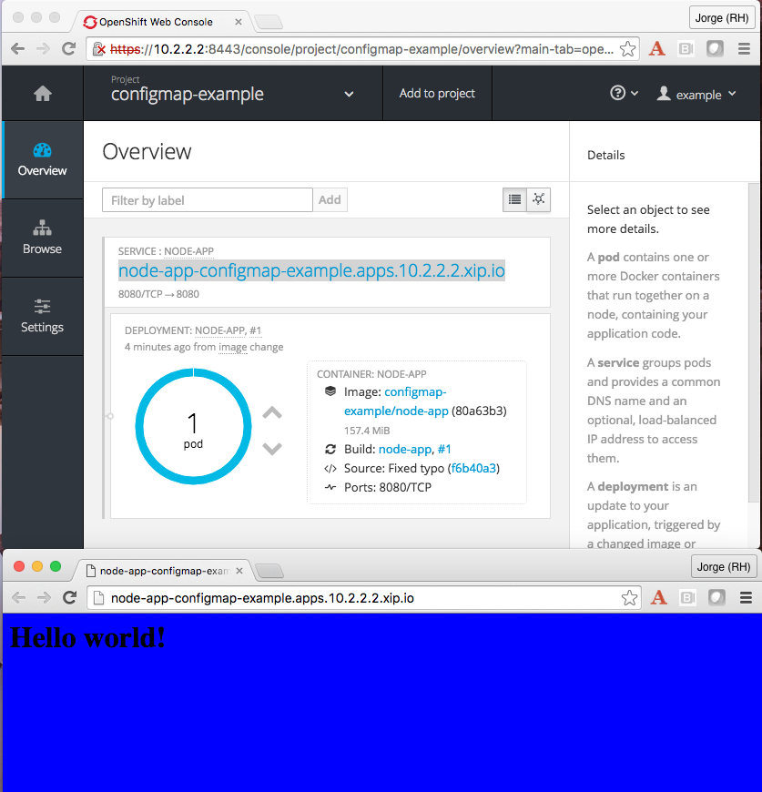

== Configuring your application, Part 1

Kubernetes 1.2, released more than a month ago, has brought many interesting additions to the Kubernetes platform, but there’s one, that relates to configuration management, that’s especially relevant for application developers, this is link:http://kubernetes.io/docs/user-guide/configmap/[ConfigMap]. In this blog entry I will share some experiences and tips on using ConfigMap that goes beyond what one of our engineers and Kubernetes contributor, Paul Morie, recently link:http://blog.kubernetes.io/2016/04/configuration-management-with-containers.html[blogged about it]. We will take advantage of this new feature in a real application that we will be promoting through different environments, from development through testing into production.

One of the challenges that we face as developers is the need to externalize application configuration as this will probably be different per environment or per deployment. In OpenShift, Docker, and Kubernetes, developers have been externalizing this configuration into Environment variables, allowing every deployment to have different values for runtime configuration. This has been a fantastic way to adhere to the third rule of the link:http://12factor.net/[12factor] methodology, “link:http://12factor.net/config[store config in the environment]”. When you think that what we, as users of OpenShift, are deploying into the platform is not a container but rather an application, that can be composed of one or multiple containers, we understand that the configuration per deployment really spans greater context than the container itself.

We need a way of having all the configuration used/needed per application centralized, so that changes in configuration will not impact the definition of the deployment. This is what ConfigMap is for.

The official link:http://kubernetes.io/docs/user-guide/configmap/[Kubernetes documentation] states:

____
Many applications require configuration via some combination of config files, command line arguments, and environment variables. These configuration artifacts should be decoupled from image content in order to keep containerized applications portable. The ConfigMap API resource provides mechanisms to inject containers with configuration data while keeping containers agnostic of Kubernetes. ConfigMap can be used to store fine-grained information like individual properties or coarse-grained information like entire config files or JSON blobs.
____

So, what type of configuration can we provide to an application or deployment?
It will typically fall under one of these categories:

* Single configuration value expressed as an environment variable for the container.
* Command line arguments in a container.
* Multiple configuration values typically set in a configuration file.

Let’s explore how we can use ConfigMaps:

I will demonstrate ConfigMap with a simple node.js app. This application will print a message as body content and will have background color configurable. We will externalize configuration into a ConfigMap. The code for the application is on link:https://github.com/jorgemoralespou/ose-app-promotion-configmap/blob/master/node-app/server.js[GitHub].

First required thing is to create a ConfigMap to hold the configuration values you want to make available to the deployment. My node.js application will get it’s background color from a property named “color” in a file named “/etc/node-app/node-app.config” in the container. It will also, look for an environment property named message for a string to be show as background message.
The configuration file contents that will be used is:

----
color=blue
----

Let’s create a ConfigMap, named *config*, with both a literal text, message=*Hello world!*, and the configuration file:

----
$ oc create configmap config \
            --from-literal=message=’Hello world!’ \
            --from-file=ui.properties
configmap "config" created
----

Let’s verify the contents of our ConfigMap.

----
$ oc get configmap/config -o json
{
    "kind": "ConfigMap",
    "apiVersion": "v1",
    "metadata": {
        "name": "config",
    },
    "data": {
        "message": "Hello world!",
        "ui.properties": "color=blue\n"
    }
}
----

NOTE: Some internal metadata has been removed from output for brevity.

Now that I have a ConfigMap with the configuration my application requires, I’m going to deploy an application that will make use of it.

In my link:https://github.com/jorgemoralespou/ose-app-promotion-configmap/blob/master/node-app/server.js[sample app], I will consume the configuration provided by the ConfigMap, mapping the ConfigMap property *message* to the environment variable *BACKGROUND_MSG* the application expects, and also mapping the *ui.properties* into a file located in */etc/node-app/node-app.config*.

----
 "template": {
   "metadata": {
      "labels": {
         "app": "node-app",
         "deploymentconfig": "node-app"
      }
   },
   "spec": {
      "containers": [
         {
            "name": "node-app",
            "image": "node-app",
            "ports": [
               {
                  "containerPort": 8080,
                  "protocol": "TCP"
               }
            ],
            "env": [
               {
                  "name": "OPENSHIFT_NODEJS_PORT",
                   "value": "8080"
               },
               {
                  "name": "BACKGROUND_MESSAGE",
                  "valueFrom": {
                     "configMapKeyRef": {
                        "name": "config",
                        "key": "message"
                      }
                   }
                }
             ],
             "volumeMounts":[
                {
                   "name": "app-config",
                   "mountPath": "/etc/node-app/"
                }
             ],
             "resources": {},
             "terminationMessagePath": "/dev/termination-log",
             "imagePullPolicy": "Always"
           }
        ],
        "volumes": [
           {
              "name": "app-config",
              "configMap": {
                 "name": "config",
                 "items": [
                    {
                       "key": "ui.properties",
                       "path": "node-app.config"
                    }
                 ]
              }
           }
        ],
        "restartPolicy": "Always",
        "terminationGracePeriodSeconds": 30,
        "dnsPolicy": "ClusterFirst",
        "securityContext": {}
     }
  }
}
----

Configuration is assembled at deployment time, so when the application is deployed and there is no ConfigMap that satisfies the DeploymentConfig, we will have a warning event in our Event log that will help us diagnose the misconfiguration that prevented the deployment to start:

One important thing to know is, when a ConfigMap is mounted as a volume, we can change the contents of the ConfigMap, and the mounted file in the container will be eventually updated, when the kubelet on the node re-synchs the pod, providing for changes in configuration in running containers. The running application needs to provide a mechanism to reload configuration changes when they happen.

In this blog we have demonstrated a way of externalizing configuration of an application. Remember, ConfigMaps are GA in Kubernetes 1.2 and OpenShift 3.2 and some improvements are still to come. Just take these simple *restrictions* into account:

* ConfigMaps must be created before they are consumed in pods.
* ConfigMaps reside in a namespace. They can only be referenced by pods in the same namespace.

The example shown in this blog can be fully executed in the Openshift Origin all-in-one Vagrant image, by doing:

----
$ git clone https://github.com/jorgemoralespou/ose-app-promotion-configmap.git
$ cd ose-app-promotion-configmap/example1
$ oc new-project configmap-example
$ oc create -f configmap-example.json
$ oc create -f node-app-deployment.json
$ oc create -f node-app-build.json
----

link:http://www.youtube.com/watch?v=vKDLz2OXu7k[See a video in action]

