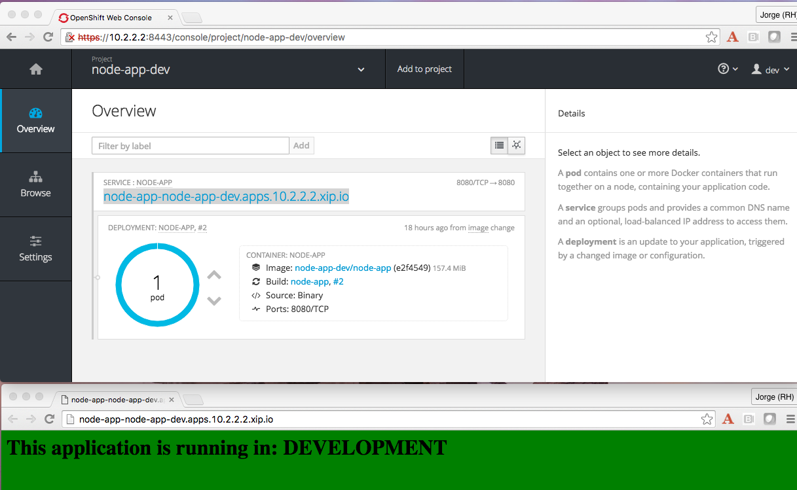
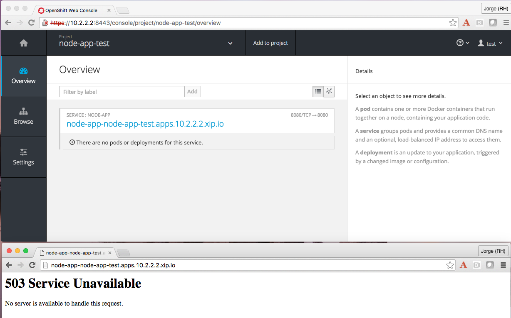
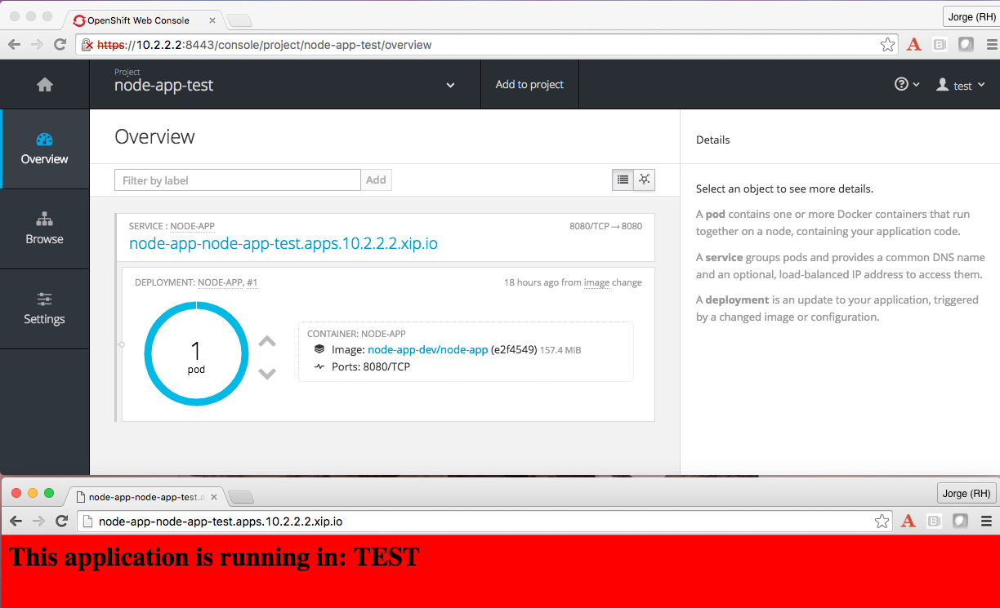

== Configuring your application, Part 2

In a real world, your applications will be transitioning from environment to environment, from development to testing and into production, as part of their lifecycle. In a container world, applications are assembled into one or many container images, hence what will be promoted are images.
In this blog I will demonstrate link:http://blog.openshift.com/configuring-your-application-part-1[the concepts we learnt about externalizing configuration] in your image promotion scenarios.
As Veer link:https://blog.openshift.com/promoting-applications-across-environments/[has previously showed], OpenShift is a platform where we can easily model the concept of stages/environments per application, and we can promote an application (image) from environment to environment just by tagging it accordingly in the project.

In this example, I will be using the same application I used before, and I will create two projects simulating two different stages/environments for my application:

* *node-app-dev* will model the development stage and will be owned by user *dev*
* *node-app-test* will model the testing stage and will be owned by user *test*

This application will be deployed with the exact same BuildConfig in both projects, but for each, a different configuration will be used by means of deploying different values in the ConfigMap. dev user, will have an additional task of building the application from source before deploying it.

----
$ git clone https://github.com/jorgemoralespou/ose-app-promotion-configmap.git

$ cd ose-app-promotion-configmap/example2

$ oc login 10.2.2.2:8443 -u dev -p dev
$ oc new-project node-app-dev
$ oc create -f configmap-dev.json
$ oc create -f node-app-deployment.json
$ oc create -f node-app-build.json
----

These commands will create a new project called node-app-dev, as user dev, and will deploy a ConfigMap, with a message and background color that will be used in development environment. Additionally, it will create the deployment configuration for the application and it will build our application from source code.

Once the process is finished, we will be able to see the result:

Now, as user *test*, we will create a ConfigMap with different contents,  reflecting our test environment , but we will use exactly the same DeploymentConfig like before. The reason for that is, we are separating the application from its configuration, by leveraging the ConfigMap resource.

----
$ git clone https://github.com/jorgemoralespou/ose-app-promotion-configmap.git

$ cd ose-app-promotion-configmap/example2

$ oc login 10.2.2.2:8443 -u test -p test
$ oc new-project node-app-test
$ oc create -f configmap-test.json
$ oc create -f node-app-build.json
----

In this project, there will be no application deployed because no image has been tagged into the test project yet:

There is one security requirement to allow dev user to tag into the test project and for a user in test project to pull down the image from the repository.

Since we are fans of fine grained security, I will be creating a new role, image-tagger, that will be granted the rights to tag an ImageStream. That role will be assigned to the dev user in the test project. This action needs to be executed as an cluster admin user:

----
$ oc login 10.2.2.2:8443 -u admin -p admin
$ oc create -f - <<EOF
{
      "kind": "ClusterRole",
      "apiVersion": "v1",
      "metadata": {
        "name": "image-tagger"
      },
      "rules": [
        {
          "verbs": [
            "get",
            "list",
            "create",
            "update",
            "edit"
          ],
          "attributeRestrictions": null,
          "apiGroups": null,
          "resources": [
            "imagestreamimages",
            "imagestreamimports",
            "imagestreammappings",
            "imagestreams",
            "imagestreamtags"
          ]
        }
      ]
    }
EOF

$ oc adm policy add-role-to-user image-tagger dev -n node-app-test
----

Additionally, we also need the user from test project to be able to pull down the image from dev project. But since in OpenShift, by default, the deployment is done by the *deployment* ServiceAccount, we need to assign the role accordingly

----
$ oc adm policy add-role-to-user system:image-puller system:serviceaccount:node-app-test:deployer -n node-app-dev
----

Now that all the required permissions are in place, we can have *dev* user to promote our application. For this he will just tag the image in the node-app-test project, and it will be automatically deployed.

----
$ oc login 10.2.2.2:8443 -u dev -p dev
$ oc tag node-app-dev/node-app:latest node-app-test/node-app:latest
----

You can now verify that the image has been promoted, and is now running in the testing environment, showing the configuration for this environment.

In this blog we have demonstrated a way of separating configuration from application so that the process of promoting an application gets easier, requiring almost none customizations of the base resources being deployed.

This blog example can be fully executed in the link:https://www.openshift.org/vm/[Openshift Origin all-in-one Vagrant image], by doing:

----
$ git clone https://github.com/jorgemoralespou/ose-app-promotion-configmap.git

$ cd ose-app-promotion-configmap/example2

$ oc login 10.2.2.2:8443 -u dev -p dev
$ oc new-project node-app-dev
$ oc create -f configmap-dev.json
$ oc create -f node-app-deployment.json
$ oc create -f node-app-build.json

$ oc login 10.2.2.2:8443 -u test -p test
$ oc new-project node-app-test
$ oc create -f configmap-test.json
$ oc create -f node-app-deployment.json

$ oc login 10.2.2.2:8443 -u admin -p admin
$ oc create -f roles.json
$ oc adm policy add-role-to-user image-tagger dev -n node-app-test
$ oc adm policy add-role-to-user system:image-puller system:serviceaccount:node-app-test:deployer -n node-app-dev

$ oc login 10.2.2.2:8443 -u dev -p dev

$ echo "If you want to promote the application, you can:"
$ echo "    oc tag node-app-dev/node-app:latest node-app-test/node-app:latest"
----
