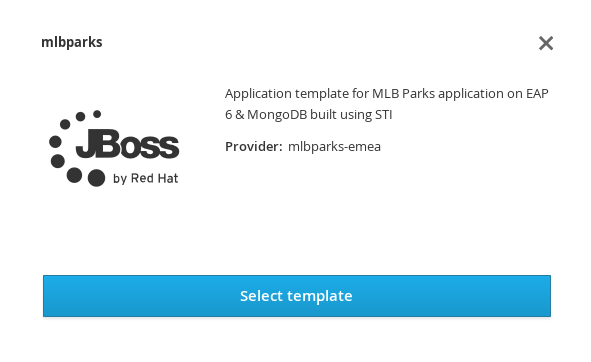
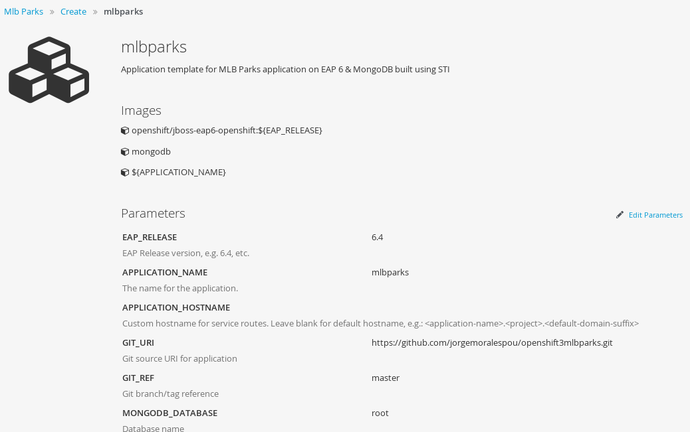

= Create an OpenShift v3 Template

This blog describes what are templates and how we can create a template for our applications in OpenShift v3.

== What is a template
From the official https://docs.openshift.com/enterprise/3.0/architecture/core_concepts/templates.html[documentation] we can read:

_____
A template describes a set of objects that can be parameterized and processed to produce a list of objects for creation by OpenShift. The objects to create can include anything that users have permission to create within a project, for example services, build configurations, and deployment configurations. A template may also define a set of labels to apply to every object defined in the template.
_____

This means that typically in a template we will have:

* A set of resources that will be created as part of "creating/deploying" the template
* A set of values for the parameters defined in the template
* A set of labels to decorating the generated resources  

Let's dig on what we would need to put into our template.

== The resources
The first thing we need to consider when creating our template is the application that we want to create/deploy. It can consist of a single component (*just the app*) or multiple components (*frontend, backend, database, ...*). This fact will dictate the type of https://docs.openshift.com/enterprise/3.0/dev_guide/deployments.html#creating-a-deployment-configuration[*deployment configuration*] that we will be using.

A deployment configuration consists of the following key parts:

* A replication controller template which describes the application to be deployed. (*What will be deployed?*)
* The default replica count for the deployment. (*How many will be deployed?*)
* A deployment strategy which will be used to execute the deployment. (*How will be deployed?*)
* A set of triggers which cause deployments to be created automatically. (*When and Why will be deployed?*)

Also, we might want to layer our source code on top any of these components. This will drive the https://docs.openshift.com/enterprise/3.0/dev_guide/builds.html#defining-a-buildconfig[*build configuration*].

A build is a process of creating runnable images to be used on OpenShift. A build configuration consists of the following key parts:

* A source description (*Where is your source code?*)
* A strategy for building (*How to build your image?*)
** Source-To-Image: Your application source will be built and layered on top of a runtime
** Docker: Your Dockerfile will be built into an image. It must provide the application and the runtime.
** Custom: You provide the building method in a Docker image.
* An output description (*Where to leave the built image*?)
* A list of triggers (*When and Why will the source be built?*)

These concepts above are the most important ones when talking about deploying an application on OpenShift, but we might also need to create https://docs.openshift.com/enterprise/3.0/architecture/core_concepts/pods_and_services.html#services[Services], https://docs.openshift.com/enterprise/3.0/dev_guide/routes.html[Routes], https://docs.openshift.com/enterprise/3.0/architecture/core_concepts/builds_and_image_streams.html#image-streams[ImageStreams], https://docs.openshift.com/enterprise/3.0/dev_guide/secrets.html[Secrets], https://docs.openshift.com/enterprise/3.0/dev_guide/persistent_volumes.html[PersistenVolumeClaims], ...

== Template Walkthrough 
Now that the have defined these OpenShift Resource Types, we are ready to create a walk through of creating a Template. 

I will use a simple example with two components (web and database) that will be exposed externally. The database will have a single instance and the web can have multiple instances. Also, the web will be built from source code on Github while the database schema will be created automatically at application startup thanks to JPA, so no need to create a database schema and insert some master data. 
We also want to deploy/redeploy our application if we change the source code of it and if we change any configuration. 

This is a basic diagram of the component architecture in a traditional environment:

NOTE: This is a simple example to demonstrate how to create a template. More complex scenarios will require more knowledge on the application. 

== Create your basic template
First step is to create a basic template. We need to identify what resources we need to create and put them together.

We are going to show the components layered on top of a basic OpenShift v3 architecture.

=== Building our application source
For this example, as we have 2 components (web and database) we will need 2 container images.

The database component will be always the same, and it will not be layering code on top, hence we do not need a BuildConfig for the database component.

The web component, on the contrary, will be layering our "source code" on top of a JBoss Web Server (Tomcat 7). We want to make sure that we will:

* Build a new image when there is new source for our application. This will require some configuration on our Git Server to be able to notify OpenShift of changes.
* Build a new image when our Builder Image changes (maybe to apply a patch in the base container server)

For this we will be creating a new BuildConfig describing the build`s source, strategy, output and triggers.

[source, json, numbered]
----
{
   "kind": "BuildConfig",
   "apiVersion": "v1",
      "metadata": {
      "name": "MYAPP",                     # <1>
      "labels": {
         "application": "MYAPP"            # <2>
      }
   },
   "spec": {
      "source": {                          # <3>
         "type": "Git",                    # <4>
         "git": {                
            "uri": "...",                  # <5>
            "ref": "..."                   # <6>
         },
         "contextDir":"..."                # <7>
      },
      "strategy": {                        # <8> 
         "type": "Source",                 # <9>
         "sourceStrategy": {
            "from": {                      # <10>
               "kind": "ImageStreamTag",
               "namespace": "openshift",
               "name": "jboss-webserver3-tomcat7-openshift:3.0"
            }
         }
      },
      "output": {                          # <11> 
         "to": {
            "kind": "ImageStreamTag",
            "name": "MYAPP:latest"
         }
      },
      "triggers": [
         {
            "type": "Github",              # <12>
            "github": {
               "secret": "..."
            }
         },
         {                                 # <13>
            "type": "Generic",
            "generic": {
               "secret": "..."
            }
         },
         {                                 # <14>
            "type": "ImageChange",
            "imageChange": {}
         }
      ]
   }
}
----
<1> This is the name that will identify this BuildConfig
<2> These are the labels that will be set for this BuildConfig.
<3> This section defines where is the source for the build.
<4> It defines it is source located in a Git repository
<5> In this uri
<6> And using this tag/branch
<7> And this subdirectory from the repository.
<8> This defines which build strategy to use. 
<9> Source=S2I 
<10> And this defines which S2I builder image to use.
<11> Defines where to leave the generated image if the build succeeds. It is placing it in our current project. 
<12> This define that a change generated via a Github trigger (If the source code is changed) will trigger a build.
<13> This define that a change generated via a Generic trigger (If the source code is changed) will trigger a build.
<14> This define that an Image Change will trigger a build. This will trigger a build if the builder image changes or is updated.

NOTE: S2I builder images provided by OpenShift are in openshift namespace. You can reference a builder image in any namespace you have read access from.

NOTE: An ImageChange trigger is responsible for generating the first build once the template is processed and the resources deployed into OpenShift. This will happen when the 
desired state in the data store is reconciled (may take up to 2 minutes)

=== Store the image we have built
In the previous section, we have built a new image with our application source code compiled and layered on a JBoss Web Server. This image was configured to be uploaded into the 
internal OpenShift registry, and tagged accordingly. In the previous example, *output* defined where to push the image and what tag to provide it.
We need to define an ImageStream in order to be able to push into the registry in the appropriate place, and be able to tag the previous image.

We create an ImageStream for this purpose.

[source, json, numbered]
----
{
   "kind": "ImageStream",
   "apiVersion": "v1",
   "metadata": {
      "name": "MYAPP",             # <1>
      "labels": {
         "application": "MYAPP"    # <2>
      }
   }
}
----
<1> Name of the ImageStream
<2> Labels decorating our ImageStream

=== Describe the web component
Now we need to describe all the configuration related to how we are going to deploy our web component. 

[source,json,numbered]
----
{
    "apiVersion": "v1",
    "kind": "DeploymentConfig",
    "metadata": {
        "labels": {
            "...": "...",  # <1>
            "application": "MYAPP"
        },
        "name": "MYAPP"    # <2>
    },
    "spec": {              # <3>
        "replicas": 3,     # <4>
        "selector": {
            "deploymentConfig": "MYAPP"   # <5>
        },
        "strategy": {
            "type": "Rolling"             # <6>
        },
        "template": {             # <7>
            "metadata": {
                "labels": {
                    "...": "...", # <8>
                    "application": "MYAPP"
                },
                "name": "MYAPP"    # <9>
            },
            "spec": {              # <10>
                "containers": [
                    {
                        "env": [
                            {
                                "....": "..." # <11>
                            }
                        ],
                        "image": "MYAPP",                   # <12>
                        "imagePullPolicy": "Always",        # <13>
                        "name": "MYAPP",                    # <14>
                        "ports": [
                            {
                                "containerPort": 8080,      # <15>
                                "name": "http",
                                "protocol": "TCP"
                            }
                        ]
                    }
                ]
            }
        },
        "triggers": [
            {
                "...": "..."         # <16>
            }
        ]
    }
}
----
<1> These are the labels that will be set for this DeploymentConfig.
<2> This is the name that will identify this DeploymentConfig
<3> Specification for the DeploymentConfig. Everything inside this section describes the DeploymentConfig configuration.
<4> Number of instances that should be created for this component/deployment
<5> This should be the same as *name* above.
<6> Strategy to use when deploying a new version of the application in case it is triggered. As defined in *triggers*
<7> The template defines what will be deployed as part of this deployment (the pod)
<8> The labels to apply for the resources contained in the template (pod)
<9> Name of the pod. Every pod instance created will have this name as prefix.
<10> Defines the configuration (contents) of the pod
<11> A set of environment variables to pass to this container
<12> The name of the image to use
<13> What should do when deploying. As we will be building the image, we need to always pull on new deployments.
<14> The name of the container.
<15> The ports that the container exposes
<16> The triggers that will dictate on what conditions to create a new deployment. (Deploy a new version of the pod)

NOTE: It is always recommended to set in every resource defined by a template a label of type *"application": "NAME_OF_MY_APP"* as then you
can link resources created as part of the processing of the template

=== Describe the database component
Now we need to describe all the configuration related to how we are going to deploy our database component.

[source,json,numbered]
----
{
    "apiVersion": "v1",
    "kind": "DeploymentConfig",
    "metadata": {
        "labels": {
            "application": "MYAPP"     # <1>
        },
        "name": "MYAPP-mysql"          # <2>
    },
    "spec": {
        "replicas": 1,                 # <3>
        "selector": {
            "deploymentConfig": "MYAPP-mysql"  # <4>
        },
        "strategy": {
            "type": "Recreate"         # <5>
        },
        "template": {
            "metadata": {
               "labels": {             # <6> 
                    "application": "MYAPP",
                    "deploymentConfig": "MYAPP-mysql"
                },
                "name": "MYAPP-mysql"  # <7>
            },
            "spec": {
                "containers": [        # <8>
                    {
                        "env": [       # <9>
                            {
                                "name": "xxx",
                                "value": "yyy"
                            }
                        ],
                        "image": "mysql",               # <10>
                        "name": "MYAPP-mysql",          # <11>
                        "ports": [                      # <12>
                            {
                                "containerPort": 3306,
                                "protocol": "TCP"
                            }
                        ]
                    }
                ]
            }
        },
        "triggers": [
            {
                ...                    # <13>     
            }
        ]
    }
}
----
<1> These are the labels that will be set for this DeploymentConfig.
<2> This is the name that will identify this DeploymentConfig
<3> Number of instances that should be created for this component/deployment
<4> This should be the same as *name* above.
<5> Strategy to use when deploying a new version of the application in case it is triggered. As defined in *triggers*
<6> The labels to apply for the resources contained in the template (pod)
<7> Name of the pod. Every pod instance created will have this name as prefix.
<8> Defines the configuration (contents) of the pod. A list of containers.
<9> A set of environment variables to pass to this container
<10> The name of the image to use
<11> The name of the container.
<12> The ports this container is exposing
<13> The triggers that will dictate on what conditions to create a new deployment. (Deploy a new version of the pod)

=== Linking the components together
As this example, uses 2 pods, one as the frontend application (web), and another as a database, we need to link both containers, so that we do not need to do any manual extra configuration after the deployment is made for the frontend to be able to access the database. We need to inject into the frontend DeploymentConfig values relative from the database DeploymentConfig.

The database DeploymentConfig expects 3 ENV variables to set up the username, password and database as https://docs.openshift.com/enterprise/3.0/using_images/db_images/mysql.html#environment-variables[documented here]. (There are other variables for configuring the MySQL database behavior).

We define these ENV variables in the database container spec section:

[source,json,numbered]
----
            "spec": {
                "containers": [
                    {
                        "env": [
                            {
                                "name": "MYSQL_USER",
                                "value": "MYUSER"
                            },
                            {
                                "name": "MYSQL_PASSWORD",
                                "value": "MYPASSWORD"
                            },
                            {
                                "name": "MYSQL_DATABASE",
                                "value": "MYDATABASE"
                            },
             ....               
----

Now, in the web pod, we need to also inject this values as parameters. In the case of this image, documentation is not very good (at the moment), but the environment variables needed are the same. There is also an additional environment variable *DB_SERVICE_PREFIX_MAPPING* that sets where is the database located. For this, we will require to create a Service, to abstract the consumer component (the web) from the location in OpenShift of the producer component (the database). Services provides an abstraction layer for pods.

We will need to create a service like this:

[source,json,numbered]
----
{
   "kind": "Service",
   "apiVersion": "v1",
   "spec": {
      "ports": [
         {
            "port": 3306,                   # <1>
            "targetPort": 3306           
         }
      ],
      "selector": {
         "deploymentConfig": "MYAPP-mysql"  # <2>
      }
   },
   "metadata": {
      "name": "MYAPP-mysql",                # <3>
      "labels": {
         "application": "MYAPP"             # <4>
      },
      "annotations": {
         "description": "The database server's port."
      }
   }
}
----
<1> The ports in the pod and exposed by the service
<2> The deploymentConfig to which will route this service
<3> The name of the service. This is the one we will be using in the ENV variables for the web pod.
<4> Labels to decorate everything is going to be created with this template

And then define our ENV variables in the web pod like this: 

[source,json,numbered]
----
            "spec": {
                "containers": [
                    {
                        "env": [
                            {
                                "name": "DB_SERVICE_PREFIX_MAPPING",
                                "value": "MYAPP-mysql=DB"                  # <1>
                            },{
                                "name": "MYSQL_USER",
                                "value": "MYUSER"
                            },
                            {
                                "name": "MYSQL_PASSWORD",
                                "value": "MYPASSWORD"
                            },
                            {
                                "name": "MYSQL_DATABASE",
                                "value": "MYDATABASE"
                            },
             ....               
---- 
<1> Name of the service to use

Now, with this configuration, our web component will be able to access our database component.

== Redeployment configuration
Now we need to configure when our application will be deployed/redeployed. We are going to modify the DeploymentConfig that we have created to set some additional behavior.

The deployment for the web component will be triggered if:

* There is a configuration change
* The ImageStreamTag for the container changes. This will happen if the image is rebuilt. 

[source, json, numbered]
----
   ....
   "strategy": {
      "type": "Recreate"               # <1>
   },
   "triggers": [
   {
      "type": "ImageChange",           # <2>
      "imageChangeParams": {
         "automatic": true,            # <3>
         "from": {                     # <4>
            "kind": "ImageStreamTag",
            "name": "MYAPP"
         },
         "containerNames": [
            "MYAPP"                    # <5>
         ]         
      }
   },
   {
      "type": "ConfigChange"           # <6>
   }
   ],
   ...
----
<1> The strategy to take for deploying a new version of the image. https://docs.openshift.com/enterprise/3.0/dev_guide/deployments.html#strategies[(Currently Recreate, Rolling and Custom)]
<2> What type of trigger will made a new deployment https://docs.openshift.com/enterprise/3.0/dev_guide/deployments.html#triggers[(Currently ConfigurationChange and ImageChange)]
<3> *automatic=true* defines that the trigger is active. 
<4> What ImageStreamTag will be triggering the deployment
<5> What containers will be checked for their tags
<6> A new deployment will happen if there is a configuration change in this DeploymentConfig

For the database deployment, it will only be deployed if the base image is changed.

[source, json, numbered]
----
   ....
   "strategy": {
      "type": "Recreate"               # <1>
   },
   "triggers": [
   {
      "type": "ImageChange",           # <2>
      "imageChangeParams": {
         "automatic": true,            # <3>
         "from": {                     # <4>
            "kind": "ImageStreamTag",
            "namespace": "openshift",
            "name": "mysql:latest"
         },
         "containerNames": [ 
            "MYAPP-mysql"              # <5>
         ]
      }
   }],
   ...
----
<1> The strategy to take for deploying a new version of the image. https://docs.openshift.com/enterprise/3.0/dev_guide/deployments.html#strategies[(Currently Recreate, Rolling and Custom)]
<2> What type of trigger will made a new deployment https://docs.openshift.com/enterprise/3.0/dev_guide/deployments.html#triggers[(Currently ConfigurationChange and ImageChange)]
<3> *automatic=true* defines that the trigger is active. 
<4> What ImageStreamTag will be triggering the deployment
<5> What containers will be checked for their tags

== Exposing the application
Now we have everything that is needed for our application to be running.

Now we need to expose some functionality of the components of our application, either internally, using https://docs.openshift.com/enterprise/3.0/architecture/core_concepts/pods_and_services.html#services[Services] for this purpose, or externally, by defining https://docs.openshift.com/enterprise/3.0/dev_guide/routes.html[Routes].

=== Create services
For every port in any of the pods that we need access, we need to create a Service. We've shown above the Service for the database component (pod) that was exposing port 3306.

The following service defines access to the web component using HTTP transport on port 8080:

[source,json,numbered]
----
{
   "kind": "Service",
   "apiVersion": "v1",
   "spec": {
      "ports": [
         {
            "port": 8080,               # <1>
            "targetPort": 8080          # <2>
         }
      ],
      "selector": {
         "deploymentConfig": "MYAPP"    # <3>
      }
   },
   "metadata": {
      "name": "MYAPP",                  # <4>
      "labels": {
         application": "MYAPP"          # <5>
      },
      "annotations": {
         "description": "The web server's http port."
      }
   }
}
----
<1> Port the service will be listening on
<2> The port on the backing pod to route to 
<3> Label selector to determine the backing pods 
<4> Name of the service
<5> Labels decorating this service

This service defines access to the web component using HTTPS transport on port 8443:

[source,json,numbered]
----
{
   "kind": "Service",
   "apiVersion": "v1",
   "spec": {
      "ports": [
         {
            "port": 8443,                # <1>
            "targetPort": 8443           # <2>
         }
      ],
      "selector": {
         "deploymentConfig": "MYAPP"     # <3>
      }
   },
   "metadata": {
      "name": "secure-MYAPP",            # <4>
      "labels": {
         "application": "MYAPP"          # <5>
      },
      "annotations": {
         "description": "The web server's https port."
      }
   }
}
----
<1> Port the service will be listening on
<2> The port on the backing pod to route to 
<3> Label selector to determine the backing pods 
<4> Name of the service
<5> Labels decorating this service

=== Create routes
Now that our web component has a service, we can create a Route for those services, and provide with an external way of accessing our web component in a DNS name registered for our platform.

This is the definition of a normal (non tls) Route. Routers are listening on port 80 for standard HTTP based traffic.

[source, json, numbered]
----
{
   "kind": "Route",
   "apiVersion": "v1",
   "id": "MYAPP-http-route",
   "metadata": {
      "name": "MYAPP-http-route",   # <1>
      "labels": {
         "application": "MYAPP"     # <2>
      },
      "annotations": {
         "description": "Route for application's http service."
      }
   },
   "spec": {
      "host": "myapp.cloudapps.example.com", # <3>
      "to": {
         "name": "MYAPP"                     # <4>
      }
   }
}
----
<1> Name of the Route
<2> Labels decorating this Route
<3> DNS entry for this route
<4> Service defining the endpoints

This is the definition of the secure Route. Routers are listening on port 443 for secure communications compliant with SNI.

[source,json,numbered]
----
{
   "kind": "Route",
   "apiVersion": "v1",
   "id": "MYAPP-https-route",
   "metadata": {
      "name": "MYAPP-https-route",            # <1>
      "labels": {
         "application": "MYAPP"               # <2>
      },
      "annotations": {
         "description": "Route for application's https service."
      }
   },
   "spec": {
      "host": "myapp.cloudapps.example.com",  # <3>
      "to": {
         "name": "secure-MYAPP"               # <4>
      },
      "tls": {
         "termination" : "passthrough"        # <5>
      }
   }
}
----
<1> Name of the Route
<2> Labels decorating this Route
<3> DNS entry for this route
<4> Service defining the endpoints
<5> As this is a secure route, it defines the tls behavior. Passing all the secure traffic to the backend untouched.

== Labeling the template
Now, we should have a set of resources that we want to create as part of our "application" or "deployment" (Sometimes how we name it can be confusing).
As we want to identify univocally the resources we are deploying as a whole, it is important that all of them have at least one label for this purpose. In the previous code we have set in all of the resources a label of:

[source, json]
----
"application": "myapp"
---- 

Also, we can set different labels that will help us decorate some other parts of the deployment, like:

[source, json]
----
"deploymentConfig": "MYAPP"
----

that helps us identify which DeploymentConfig we will link a Service to.

=== Why labels are important
Labels can be used for filtering resources on a query, for example:

[source,bash]
----
oc get buildconfig --selector="application=MYAPP"
oc get deploymentconfig --selector="deploymentConfig=MYAPP"
----

Also, they can be used to delete in one operation every resource we have created, like:

[source,bash]
----
oc delete all --selector="application=MYAPP"
----

== Parameterizing a template
It is time to make the template reusable, as that is the main purpose of a template. For this, we will:

* Identify what information will be parameterized
* Change values for parameters placeholders to make the template configurable
* Create the parameters section for the template

=== Identify parameters
First thing we need to identify is what will be the information in the template we want to parameterized. Here we will be looking into things like the application name, git configuration, secrets, inter component communications configuration, DNS where to expose the Route, ...

=== Set the parameter placeholders
Once we know the parameters that we will be setting, we will replace the values with a parameter placeholder, so when we process the template, the provided values replace the placeholders.

A property placeholder will look like:

[source]
----
${MY_PARAMETER_NAME}
----

And we will something like the following for one of our BuildConfig:

[source, json]
----
{
   "kind": "BuildConfig",
   "apiVersion": "v1",
   "metadata": {
      "name": "${APPLICATION_NAME}",
      "labels": {
         "application": "${APPLICATION_NAME}"
      }
   },
   "spec": {
      "source": {
         "type": "Git",
         "git": {
            "uri": "${GIT_URI}",
            "ref": "${GIT_REF}"
         },
         "contextDir":"${GIT_CONTEXT_DIR}"
      },
      "strategy": {
         ...
      },
      "output": {
         "to": {
            "kind": "ImageStreamTag",
            "name": "${APPLICATION_NAME}:latest"
         }
      },
      "triggers": [
         {
            "type": "Github",
            "github": {
               "secret": "${GITHUB_TRIGGER_SECRET}"
            }
         },
         {
            "type": "Generic",
            "generic": {
               "secret": "${GENERIC_TRIGGER_SECRET}"
            }
         },
         {
            "type": "ImageChange",
            "imageChange": {}
         }
      ]
   }
}
----

=== Create the parameters
Once we have set all the placeholders in the resources, we will create a section in the template for the parameters. There will be https://docs.openshift.com/enterprise/3.0/architecture/core_concepts/templates.html#parameters[2 types of parameters]:

* Parameters with auto generated values (using a regexp like expression)
* Parameters with default values (maybe empty value)

----
"parameters": [
   {
      "description": "The name for the application.",
      "name": "APPLICATION_NAME",
      "value": "sample-app"
   },
   {
      "description": "Custom hostname for service routes.  Leave blank for default hostname",
      "name": "APPLICATION_HOSTNAME",
      "value": ""
   },
   {
      "description": "Git source URI for application",
      "name": "GIT_URI"
   },
   {
      "description": "Database name",
      "name": "DB_DATABASE",
      "value": "root"
   },
   {
   "description": "Database user name",
      "name": "DB_USERNAME",
      "from": "user[a-zA-Z0-9]{3}",
      "generate": "expression"
   },
   {
      "description": "Database user password",
      "name": "DB_PASSWORD",
      "from": "[a-zA-Z0-9]{8}",
      "generate": "expression"
   }
   ....
]   
----

Now we are all set, we do have a template. You can see the https://github.com/jboss-openshift/application-templates/blob/ose-v1.0.0/webserver/jws-tomcat7-mysql-sti.json[full source of the template]. 

image::template_files/res-OSE_Templates_blog_2_final.png[align="center"]

As can be seen, this template defines 7 new resources.

== Registering the template
We need to register the template for use. We need to do it with the CLI and we will be able to create it for:

* General use
* Only for use in a Project

=== Registering the template for General Use
We will execute the creation of the template as user cluster-admin and the template will be registered in the *openshift* project (which is internal to OpenShift for holding shared resources)

[source, bash]
----
$ oc create -f my_template.json -n openshift
----

=== Registering the template for use in a Project
We will execute the creation of the template as a user in the current project. (The user will need to have the appropriate roles to create "Template" resources in the current project)

[source, bash]
----
oc create -f my_template.json
----

If the user belongs to multiple projects, and wants to create the template in a different project from the one he's currently working on, he can do it with *-n <project>*.

[source, bash]
----
oc create -f my_template.json -n <project>
----

== Inspecting a template
Before using a template, we need to know:

* the template name
* the description of the template
* the expected parameters

=== List all the available templates
For viewing all the available templates for use (using the CLI) we will have to, list the templates in the "openshift project" and in the user`s current project.

[source, bash]
----
$ oc get templates -n openshift
oc get templates -n openshift
NAME                                    DESCRIPTION                                                                        PARAMETERS        OBJECTS
cakephp-example                         An example CakePHP application with no database                                    13 (7 blank)      5
dancer-example                          An example Dancer application with no database                                     6 (2 blank)       5
eap6-basic-sti                          Application template for EAP 6 applications built using STI.                       15 (6 blank)      8
eap6-mongodb-sti                        Application template for EAP 6 MongDB applications built using STI.                23 (10 blank)     10
eap6-mysql-sti                          Application template for EAP 6 MySQL applications built using STI.                 24 (12 blank)     10
eap6-postgresql-sti                     Application template for EAP 6 PostgreSQL applications built using STI.            21 (9 blank)      10
jws-tomcat7-basic-sti                   Application template for JWS applications built using STI.                         14 (3 blank)      7
jws-tomcat7-mongodb-sti                 Application template for JWS MongoDB applications built using STI.                 22 (7 blank)      9
jws-tomcat7-mysql-sti                   Application template for JWS MySQL applications built using STI.                   23 (9 blank)      9
....

$ oc get templates
NAME                                    DESCRIPTION                                                                        PARAMETERS        OBJECTS
----

From this list, we will get the name of the template we want to use.

=== Inspect a template
We need more information about the template, so we are going to describe the template:

[source, bash]
----
$ oc describe template jws-tomcat7-mysql-sti -n openshift
Name:    jws-tomcat7-mysql-sti
Created: 25 hours ago
Labels:     <none>
Description:   Application template for JWS MySQL applications built using STI.
Annotations:   iconClass=icon-tomcat

Parameters:     
    Name:      JWS_RELEASE
    Description:  JWS Release version, e.g. 3.0, 2.1, etc.
    Value:     3.0
    Name:      APPLICATION_NAME
    Description:  The name for the application.
    Value:     jws-app
    Name:      APPLICATION_HOSTNAME
    Description:  Hostname for service routes
    Value:     jws-app.local
    Name:      GIT_URI
    Description:  Git source URI for application
    Value:     <none>
    Name:      GIT_REF
    Description:  Git branch/tag reference
    Value:     master
    Name:      GIT_CONTEXT_DIR
    Description:  Path within Git project to build; empty for root project directory.
    Value:     <none>
    Name:      DB_JNDI
    Description:  Database JNDI name used by application to resolve the datasource, e.g. java:/jboss/datasources/mongodb
    Value:     <none>
    Name:      DB_DATABASE
    Description:  Database name
    Value:     root
    Name:      JWS_HTTPS_SECRET
    Description:  The name of the secret containing the certificate files
    Value:     jws-app-secret
    Name:      JWS_HTTPS_CERTIFICATE
    Description:  The name of the certificate file within the secret
    Value:     server.crt
    Name:      JWS_HTTPS_CERTIFICATE_KEY
    Description:  The name of the certificate key file within the secret
    Value:     server.key
    Name:      JWS_HTTPS_CERTIFICATE_PASSWORD
    Description:  The certificate password
    Value:     <none>
    Name:      MYSQL_LOWER_CASE_TABLE_NAMES
    Description:  Sets how the table names are stored and compared.
    Value:     <none>
    Name:      MYSQL_MAX_CONNECTIONS
    Description:  The maximum permitted number of simultaneous client connections.
    Value:     <none>
    Name:      MYSQL_FT_MIN_WORD_LEN
    Description:  The minimum length of the word to be included in a FULLTEXT index.
    Value:     <none>
    Name:      MYSQL_FT_MAX_WORD_LEN
    Description:  The maximum length of the word to be included in a FULLTEXT index.
    Value:     <none>
    Name:      MYSQL_AIO
    Description:  Controls the innodb_use_native_aio setting value if the native AIO is broken.
    Value:     <none>
    Name:      DB_USERNAME
    Description:  Database user name
    Generated:    expression
    From:      user[a-zA-Z0-9]{3}

    Name:      DB_PASSWORD
    Description:  Database user password
    Generated:    expression
    From:      [a-zA-Z0-9]{8}

    Name:      JWS_ADMIN_USERNAME
    Description:  JWS Admin User
    Generated:    expression
    From:      [a-zA-Z0-9]{8}

    Name:      JWS_ADMIN_PASSWORD
    Description:  JWS Admin Password
    Generated:    expression
    From:      [a-zA-Z0-9]{8}

    Name:      GITHUB_TRIGGER_SECRET
    Description:  Github trigger secret
    Generated:    expression
    From:      [a-zA-Z0-9]{8}

    Name:      GENERIC_TRIGGER_SECRET
    Description:  Generic build trigger secret
    Generated:    expression
    From:      [a-zA-Z0-9]{8}

Object Labels: template=jws-tomcat7-mysql-sti

Objects:     
    Service    ${APPLICATION_NAME}-http-service
    Service    ${APPLICATION_NAME}-https-service
    Service    ${APPLICATION_NAME}-mysql
    Route      ${APPLICATION_NAME}-http-route
    Route      ${APPLICATION_NAME}-https-route
    ImageStream      ${APPLICATION_NAME}
    BuildConfig      ${APPLICATION_NAME}
    DeploymentConfig ${APPLICATION_NAME}
    DeploymentConfig ${APPLICATION_NAME}-mysql
----

== Creating resources from a template
Now we are ready to instantiate our template. We will provide our own values for the parameters defined in the template.
The processing of the template will create all the resources defined by the template in the current project.

=== From the Web UI
To create the resources from an uploaded template using the web console:

[start=1]
. While in the desired project, click on the Create+ button:

image::template_files/create.png["Create",align="center"]

[start=2]
. Select a template from the list of templates in your project, or provided by the global template library:

[start=3]
. View template parameters in the template creation screen:

[start=4]
. Modify template parameters in the template creation screen:

image::template_files/create_2.png["Modify",align="center"]

[start=5]
. Click create. This will deploy all the processed resources defined in the template in the current project.

=== From the CLI
Using the CLI to create the resources from a template it is a two step process:

==== Processing the template
The processing of the template will replace all the parameter place holders. We can specify our values with *-v* and a comma separated list of KEY=VALUE pairs. 

[source, bash]
----
$ oc process jws-tomcat7-mysql-sti -n openshift -v APPLICATION_NAME=helloworld,GIT_URI=https://github.com/jboss-openshift/openshift-examples,GIT_CONTEXT_DIR=helloworld,APPLICATION_HOSTNAME=helloworld.cloudapps.example.com > my_processed_template.json
----

NOTE: By default *oc process* will output in stdout the processed resources. We will redirect the output into a file for later use.

==== Creating the resources
Now, we will use the command to create resources defined in a source file.

[source, bash]
----
$ oc create -f my_processed_template.json
----

==== Processing and creating in a single step:
If we want to do both commands in one step, we can just pipe the output of the *process* into the *resource creation*:

[source, bash]
----
$ oc process jws-tomcat7-mysql-sti -n openshift -v APPLICATION_NAME=helloworld,GIT_URI=https://github.com/jboss-openshift/openshift-examples,GIT_CONTEXT_DIR=helloworld,APPLICATION_HOSTNAME=helloworld.cloudapps.example.com | oc create -f -
----

== Things you should remember
Finally, some important things you should remember when creating templates.

* When the resources in a template are created, if there is a BuildConfiguration defined, it will only start an automated build if there is an ImageChange trigger defined
* Templates can be shared or per-project, and common templates are in the *openshift* namespace/project.
* Currently there is no ability to set a Readme on templates, so be as verbose and complete in the template's description.
* Once the resources in a template are processed and deployed, can be modified with the CLI.
* You should constrain the cpu and memory a container in a pod can use. 