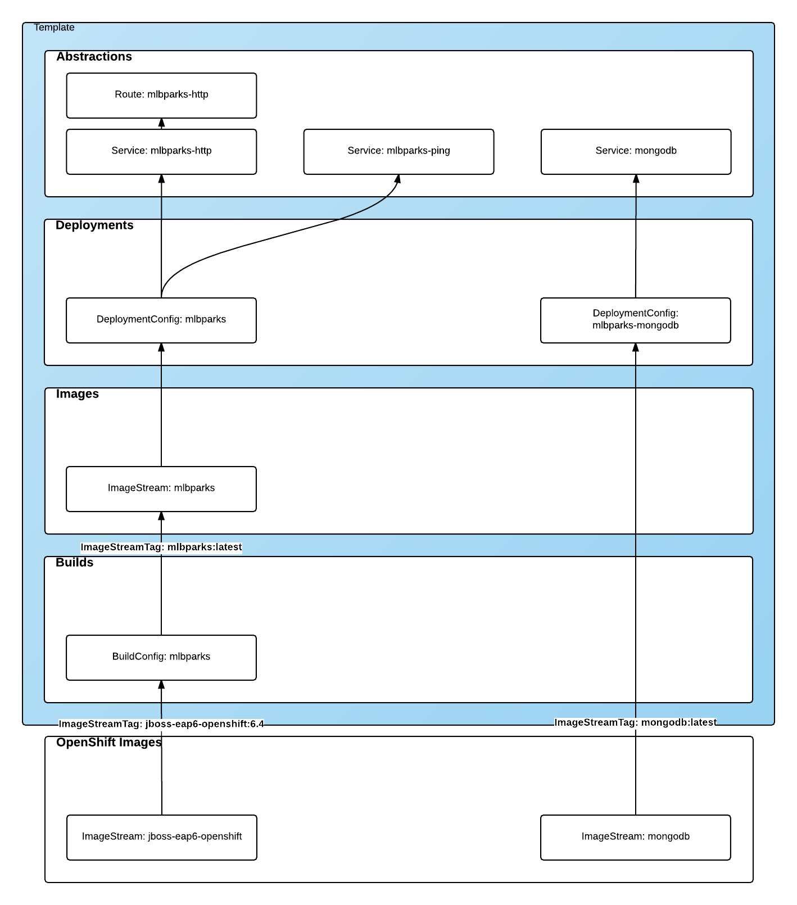
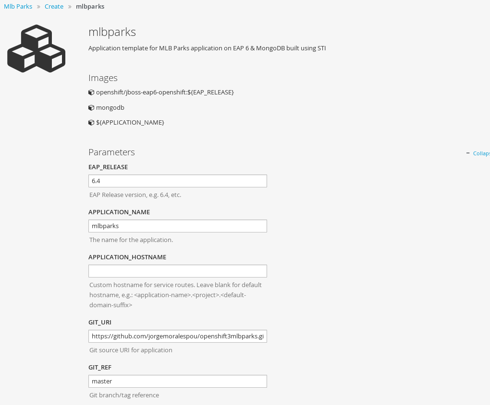

= Part 2: Create a template. A technical walkthrough

This is Part 2 of a 2 part series of blogs that will help you bringing your applications into OpenShift.

Now that we already know what is a template, and why we should use templates, let's walk through the process of creating a template for our application.

== Our application
For this example, we are going to bring into OpenShift an application that will display a map and perform geospatial queries to populate the map with all Major League Baseball stadiums in the United States.
Source for this application can be found in https://github.com/jorgemoralespou/openshift3mlbparks[my openshift3mlbparks GitHub repository].

The deployment architecture will consist of:

* JBoss Enterprise Application Server with a JavaEE application as frontend tier
* MongoDB server with data corresponding to the location of the MLB Stadiums in the US as backend/data tier

As the frontend tier is stateless, we will be able to deploy many JBoss EAP instances.

We want to access our application in a single DNS name (e.g. mlbsparks.cloudapss.example.com).

== Design our template
The first thing we will need to do is design the contents of our template. The best approach I've found so far is to think of a template as a set of layers of resources with the following structure (from bottom up):

* *Openshift Images*: Base images we will be using for our containers.
* *Builds*: Generate an image from source code (application source or Dockerfile source).
* *Images*: Images produced by the builds.
* *Deployments*: What images will be deployed and how.
* *Abstractions*: Additional resources needed for our application, like networking, storage, security,...

=== Layer 0: OpenShift images
In this first layer, we will need to define all the "base" images we will be using for our containers. These images typically will not be part of the template, but they need to be identified. These can be S2I images or plain Docker images. 

ImageStream::
An image stream presents a single virtual view of related images, as it may contain images from:

* Its own image repository in OpenShift’s integrated Docker Registry
* Other image streams
* Docker image repositories from external registries.

::
OpenShift stores complete metadata about each image (e.g., command, entrypoint, environment variables, etc.). Images in OpenShift are immutable.

ImageStreamImage::
An ImageStreamImage is used to reference or retrieve an image for a given image stream and image name. It uses the following convention for its name: <image stream name>@<name>

ImageStreamTag::
An ImageStreamTag is used to reference or retrieve an image for a given image stream and tag. It uses the following convention for its name: <image stream name>:<tag>

In our sample application, we will be using 2 base images:

* for the frontend component of our application, where we will be using a S2I enabled JBoss EAP image. We will be using a specific tag, 6.4 of this image. As this image will be used for building purposes, the specific usage will be defined in the Build layer.
* for the backend component of our application we will be using a mongodb database. We will be using the latest available image. As this image is a ready to use image, the specific usage of this image will be defined in the Deployment layer.

NOTE: Both ImageStreams are provided by OpenShift 3 out of the box, hence they are installed in the openshift project (namespace).

For more information see https://docs.openshift.com/enterprise/3.0/architecture/core_concepts/builds_and_image_streams.html#image-streams[the official documentation].

=== Layer 1: Builds
This layer defines all the builds we will require for our application. A build is the process of transforming input parameters into a resulting object. Most often, the process is used to transform source code into a runnable image.

BuildConfig::
A https://docs.openshift.com/enterprise/3.0/dev_guide/builds.html#defining-a-buildconfig[*BuildConfig*] object is the definition of the entire build process.
::
A build configuration consists of the following key parts:

* A source description (*Where is your source code?*)
* A strategy for building (*How to build your image?*)
** _Source-To-Image_: Transform your application into a runnable docker image, using a S2I image for building and running your application.
** _Docker_: Your Dockerfile will be built into an image. This image will contain both, the runtime and the application already built.
** _Custom_: You provide the building method in a Docker image.
* An output description (*Where to place the built image*?)
* A list of triggers (*When and Why will the source be built?*)

In our sample application we will be building the frontend component, layering our application on top of an EAP runtime.

[source,json]
----
{
   "kind": "BuildConfig",
   "apiVersion": "v1",
   "metadata": {
      "name": "mlbparks",             # <1>
      "labels": {
         "application": "mlbparks"    # <2>
      }
   },
   "spec": {
      "source": {                     # <3>
         "type": "Git",               # <4>
         "git": {
            "uri": "https://github.com/jorgemoralespou/openshift3mlbparks.git",  # <5>
            "ref": "master"           # <6>
         },
         "contextDir":""              # <7> 
      },
      "strategy": {                   # <8>
         "type": "Source",            # <9>
         "sourceStrategy": {
            "from": {                 # <10>
               "kind": "ImageStreamTag",
               "namespace": "openshift",
               "name": "jboss-eap6-openshift:6.4"
            }
         }
      },
      "output": {                     # <11>
         "to": {
            "kind": "ImageStreamTag",
            "name": "mlbparks:latest"
         }
      },
      "triggers": [
         {
            "type": "GitHub",         # <12>
            "generic": {
               "secret": "secret"
            }
         },
         {
            "type": "Generic",        # <13>
            "github": {
               "secret": "secret"
            }
         },
         {
            "type": "ImageChange",    # <14>
            "imageChange": {}
         }
      ]
   }
}
----
<1> This is the name that will identify this BuildConfig
<2> These are the labels that will be set for this BuildConfig.
<3> This section defines where is the source for the build.
<4> It defines it is source located in a Git repository
<5> In this uri
<6> And using this tag/branch
<7> And this subdirectory from the repository.
<8> This defines which build strategy to use. 
<9> Source=S2I 
<10> And this defines which S2I builder image to use.
<11> Defines where to leave the generated image if the build succeeds. It is placing it in our current project. 
<12> This define that a change generated via a GitHub trigger (if the source code is changed) will trigger a build.
<13> This define that a change generated via a Generic trigger will trigger a build.
<14> This define that an Image Change will trigger a build. This will trigger a build if the builder image changes or is updated.

For more information see https://docs.openshift.com/enterprise/3.0/architecture/core_concepts/builds_and_image_streams.html#builds[the official documentation].

=== Layer 2: Images
This layer defines all the images produced by the builds.

In our sample application we will be producing an image defined in a new ImageStream.

[source,json]
----
{
   "kind": "ImageStream",
   "apiVersion": "v1",
   "metadata": {
      "name": "mlbparks",            # <1>
      "labels": {
         "application": "mlbparks"   # <2>
      }
   },
   "spec": {                         # <3>
      "dockerImageRepository": "",   # <4>
      "tags": [                      # <5>
         {
            "name": "latest" 
         }
      ]
   }
}
----
<1> Name of the ImageStream. This ImageStream will be created in the current project.
<2> Label to describe the resource relative to the application we are creating.
<3> ImageStream Specifications
<4> Docker Repository backing this image stream.
<5> List of available tags or image stream locators for this image stream.

As a result of the build process, for every build OpenShift will create a new version of the image, that we will always be tagged as latest (as seen in the BuildConfig's output spec).

For more information see https://docs.openshift.com/enterprise/3.0/architecture/core_concepts/builds_and_image_streams.html#image-streams[the official documentation].

=== Layer 3: Deployments
This layer defines the core of our applications. It defines what will be running in OpenShift.

DeploymentConfig::
A https://docs.openshift.com/enterprise/3.0/architecture/core_concepts/deployments.html#deployments-and-deployment-configurations[*DeploymentConfig*] is a definition of what will be deployed and running on OpenShift 3.

::
A deployment configuration consists of the following key parts:

* A replication controller template which describes the application to be deployed. (*What will be deployed?*)
* The default replica count for the deployment. (*How many instances will be deployed and running?*)
* A deployment strategy which will be used to execute the deployment. (*How it will be deployed?*)
* A set of triggers which cause deployments to be created automatically. (*When and Why will it be deployed?*)

In our sample application we will have 2 DeploymentConfig, one for the frontend component (JavaEE application) and onother for the frontend component (mongodb).

The DeploymentConfig for our frontend component will define that:

* will have a pod with a single container, using the previously built mlbparks image.
* there will be initially 1 replica
* there will be a new deployment every time there is a new image built or there is s change in the configuration
* the redeployment strategy will be "Recreate", which means discard all running pods and create new ones. 

[source,json]
----
{
   "kind": "DeploymentConfig",
   "apiVersion": "v1",
   "metadata": {
      "name": "mlbparks",                 # <1>
      "labels": {                         # <2>
         "deploymentConfig": "mlbparks",   
         "application": "mlbparks"
      }
   },
   "spec": {                              # <3>
      "replicas": 1,                      # <4>
      "selector": {
         "deploymentConfig": "mlbparks"   # <5>
      },
      "strategy": {
         "type": "Recreate"               # <6>
      },
      "template": {                       # <7>
         "metadata": {
            "labels": {                   # <8>
               "deploymentConfig": "mlbparks",
               "application": "mlbparks"
            },
            "name": "mlbparks"            # <9>
         },
         "spec": {                        # <10>
            "containers": [
               {
                  "name": "mlbparks",          # <11>
                  "image": "mlbparks",         # <12>
                  "imagePullPolicy": "Always", # <13>
                  "env": [                     # <14>
                     {
                        "name": "OPENSHIFT_DNS_PING_SERVICE_NAME",
                        "value": "mlbparks-ping"
                     },
                     {
                        "name": "OPENSHIFT_DNS_PING_SERVICE_PORT",
                        "value": "8888"
                     },
                     {
                        "name": "MONGODB_USER",
                        "value": "user"
                     },
                     {
                        "name": "MONGODB_PASSWORD",
                        "value": "password"
                     },
                     {
                        "name": "MONGODB_DATABASE",
                        "value": "database"
                     }
                  ],
                  "ports": [                   # <15>
                     {
                        "name": "mlbparks-http",
                        "containerPort": 8080,
                        "protocol": "TCP"
                     },
                     {
                        "name": "mlbparks-ping",
                        "containerPort": 8888,
                        "protocol": "TCP"
                     }
                  ],
                  "readinessProbe": {         # <16>
                     "exec": {
                        "command": [
                           "/bin/bash",
                           "-c",
                           "/opt/eap/bin/readinessProbe.sh"
                        ]
                     }
                  },
                  "resources": {},
                  "terminationMessagePath": "/dev/termination-log",
                  "securityContext": {        # <17>
                     "capabilities": {},
                     "privileged": false
                  }
               }
            ],
            "restartPolicy": "Always",
            "dnsPolicy": "ClusterFirst"
         }
      },
      "triggers": [                           # <18>
         {                                   
            "type": "ImageChange",            # <19>
            "imageChangeParams": {
               "automatic": true,
               "containerNames": [
                  "mlbparks"
               ],
               "from": {
                  "kind": "ImageStreamTag",
                  "name": "mlbparks:latest"
               }
            }
         },
         {                                    # <20>
            "type": "ConfigChange"
         }
      ]
   }
}
----
<1> This is the name that will identify this DeploymentConfig
<2> These are the labels that will describe this DeploymentConfig.
<3> Specification for the DeploymentConfig. Everything inside this section describes the DeploymentConfig configuration.
<4> Number of instances that should be created for this component/deployment
<5> This should be the same as *name* above.
<6> Strategy to use when deploying a new version of the application in case it is triggered. As defined in *triggers*
<7> The template defines what will be deployed as part of this deployment (the pod)
<8> The labels to apply for the resources contained in the template (pod)
<9> Name of the pod. Every pod instance created will have this name as prefix.
<10> Defines the configuration (contents) of the pod
<11> The name of the container.
<12> The name of the image to use
<13> What should do when deploying. As we will be building the image, we need to always pull on new deployments.
<14> A set of environment variables to pass to this container
<15> The ports that the container exposes
<16> Probe that will determine if the runtime in the container has started succesfully, and traffic can be routed to it.
<17> SecurityContextContraint to use for the container
<18> The triggers that will dictate on what conditions to create a new deployment. (Deploy a new version of the pod)
<19> Create a new deployment when the latest image tag is updated
<20> Create a new deployment when there is a configuration change for this Resource.

NOTE: It is always recommended to set in every resource defined by a template a label of type *"application": "NAME_OF_MY_APP"* as then you
can link resources created as part of the processing of the template. This can be done resource by resource, as described here, or all at once.

The DeploymentConfig for our backend component will define that:

* will have a pod with a single container using the mongodb openshift base image.
* there will be initially 1 replica
* there will be a new deployment every time there is a new image built or there is s change in the configuration
* the redeployment strategy will be "Recreate", which means discard all running pods and create new ones. 
* have a persistent volume on the host's filesystem. (No valid for HA or host failover)

[source,json]
----
{
   "kind": "DeploymentConfig",
   "apiVersion": "v1",
   "metadata": {
      "name": "mlbparks-mongodb",                 # <1>
      "labels": {                                 # <2>
         "application": "mlbparks"
      }
   },
   "spec": {
      "replicas": 1,                              # <3>
      "selector": {                               # <4>
         "deploymentConfig": "mlbparks-mongodb"   # <5>
      },
      "strategy": {
         "type": "Recreate"                       # <6>
      },
      "template": {                               # <7>
         "metadata": {
            "labels": {                           # <8>
               "deploymentConfig": "mlbparks-mongodb",
               "application": "mlbparks"
            },
            "name": "mlbparks-mongodb"            # <9>
         },
         "spec": {                                # <10>
            "containers": [
               {
                  "name": "mlbparks-mongodb",         # <11>
                  "image": "mongodb",                 # <12>
                  "imagePullPolicy": "IfNotPresent",  # <13>
                  "env": [                            # <14>
                     {
                        "name": "MONGODB_USER",
                        "value": "user"
                     },
                     {
                        "name": "MONGODB_PASSWORD",
                        "value": "password"
                     },
                     {
                        "name": "MONGODB_DATABASE",
                        "value": "database"
                     }
                  ],
                  "ports": [                          # <15> 
                     {
                        "containerPort": 27017,
                        "protocol": "TCP"
                     }
                  ],
                  "resources": {},
                  "volumeMounts": [                   # <16> 
                     {
                        "name": "mlbparks-mongodb-data",
                        "mountPath": "/var/lib/mongodb/data"
                     }
                  ],
                  "terminationMessagePath": "/dev/termination-log",
                  "securityContext": {                # <17>
                     "capabilities": {},
                     "privileged": false
                  }
               }
            ],
            "volumes": [                              # <18>
               {
                  "name": "mlbparks-mongodb-data",
                  "emptyDir": {}
               }
            ],
            "restartPolicy": "Always",
            "dnsPolicy": "ClusterFirst"
         }
      },
      "triggers": [                                   # <19>
         {
            "type": "ImageChange",                    # <20>
            "imageChangeParams": {  
               "automatic": true,
               "containerNames": [
                  "mlbparks-mongodb"
               ],
               "from": {
                  "kind": "ImageStreamTag",
                  "namespace": "openshift",
                  "name": "mongodb:latest"
               }
            }
         },
         {                                             # <21>
            "type": "ConfigChange"
         }
      ]
   }
}
----
<1> This is the name that will identify this DeploymentConfig
<2> These are the labels that will describe this DeploymentConfig.
<3> Specification for the DeploymentConfig. Everything inside this section describes the DeploymentConfig configuration.
<4> Number of instances that should be created for this component/deployment
<5> This should be the same as *name* above.
<6> Strategy to use when deploying a new version of the application in case it is triggered. As defined in *triggers*
<7> The template defines what will be deployed as part of this deployment (the pod)
<8> The labels to apply for the resources contained in the template (pod)
<9> Name of the pod. Every pod instance created will have this name as prefix.
<10> Defines the configuration (contents) of the pod
<11> The name of the container.
<12> The name of the image to use
<13> What should do when deploying. As we will be building the image, we need to always pull on new deployments.
<14> A set of environment variables to pass to this container
<15> The ports that the container exposes
<16> Volume mounts used in the container
<17> SecurityContextContraint to use for the container
<18> Volumes required for the pod
<19> The triggers that will dictate on what conditions to create a new deployment. (Deploy a new version of the pod)
<20> Create a new deployment when the latest image tag is updated
<21> Create a new deployment when there is a configuration change for this Resource.

For more information see https://docs.openshift.com/enterprise/3.0/architecture/[the official documentation].

=== Layer 4: Abstractions
This layer defines all of the additional resources needed for our application to run, like networking, storage, security,...

Service::
A https://docs.openshift.com/enterprise/3.0/architecture/core_concepts/pods_and_services.html#services[service] serves as an internal load balancer. It identifies a set of replicated pods in order to proxy the connections it receives to them. Backing pods can be added to or removed from a service arbitrarily while the service remains consistently available, enabling anything that depends on the service to refer to it at a consistent internal address.
::
Services are assigned an IP address and port pair that, when accessed, proxy to an appropriate backing pod. A service uses a label selector to find all the containers running that provide a certain network service on a certain port.

Route::
An OpenShift https://docs.openshift.com/enterprise/3.0/dev_guide/routes.html[route] exposes a service at a host name, like www.example.com, so that external clients can reach it by name

PersistentVolumeClaim::
You can make a request for storage resources using a https://docs.openshift.com/enterprise/3.0/dev_guide/persistent_volumes.html[PersistentVolumeClaim] object; the claim is paired with a volume that generally matches your request.

ServiceAccount::
https://docs.openshift.com/enterprise/3.0/dev_guide/service_accounts.html[Service accounts] provide a flexible way to control API access without sharing a regular user’s credentials

Secret::
A https://docs.openshift.com/enterprise/3.0/dev_guide/secrets.html[secret] provides a mechanism to hold sensitive information such as passwords, OpenShift client config files, dockercfg files, etc. Secrets decouple sensitive content from the pods that use it and can be mounted into containers using a volume plug-in or used by the system to perform actions on behalf of a pod. 

NOTE: These are not all of the possible abstractions. Read the https://docs.openshift.com/enterprise/3.0/welcome/index.html[official documentation] for more.

In our example, we will need a set of services abstracting the deployments:

A service for the backend component (mongodb). This service will be configured to target all pods running created with a label of *deploymentConfig=mlbparks-mongodb* which happens
for every pod created by the DeploymentConfig specified (as we can see in the DeploymentConfig for the backend component).

[source,json]
----
{
   "kind": "Service",
   "apiVersion": "v1",
   "metadata": {
      "name": "mongodb",             # <1>
      "labels": {
         "application": "mlbparks"   # <2>
      }
   },
   "spec": {
      "ports": [                     
         {
            "port": 27017,           # <3>
            "targetPort": 27017      # <4>
         }
      ],
      "selector": {                  # <5> 
         "deploymentConfig": "mlbparks-mongodb"
      }
   }
}
----
<1> Name of the service
<2> Labels describing this Service
<3> Port where the Service will be listening
<4> Port in the pod to route the network traffic to
<5> Label selector for determining which pods will be target for this service

A service for the frontend component (JBoss EAP). This service will be configured to target all pods running created with a label of *deploymentConfig=mlbparks* which happens
for every pod created by the DeploymentConfig specified (as we can see in the DeploymentConfig for the frontend component).

[source,json]
----
{
   "kind": "Service",
   "apiVersion": "v1",
   "metadata": {
      "name": "mlbparks-http",           # <1>
      "labels": {
         "application": "mlbparks"       # <2> 
      },
      "annotations": {
         "description": "Ping service for clustered applications"
      }
   },
   "spec": {
      "ports": [
         {
            "port": 8080,                # <3>
            "targetPort": 8080           # <4>
         }
      ],
      "selector": {
         "deploymentConfig": "mlbparks"  # <5>
      }
   }
}
----
<1> Name of the service
<2> Labels describing this Service
<3> Port where the Service will be listening
<4> Port in the pod to route the network traffic to
<5> Label selector for determining which pods will be target for this service

JBoss EAP currently needs an additional service for it's internal PING service, that is used for clustering purposes. This service will be configured to target all pods running created with a label of *deploymentConfig=mlbparks* which happens for every pod created by the DeploymentConfig specified (as we can see in the DeploymentConfig for the frontend component).

[source,json]
----
{
   "kind": "Service",
   "apiVersion": "v1",
   "metadata": {
      "name": "mlbparks-ping",           # <1>   
      "labels": {
         "application": "mlbparks"       # <2>
      },
      "annotations": {
         "description": "Ping service for clustered applications"
      }
   },
   "spec": {
      "ports": [
         {
            "port": 8888,                # <3>
            "targetPort": 8888           # <4>
         }
      ],
      "selector": {
         "deploymentConfig": "mlbparks"  # <5>
      }
   }
}
----
<1> Name of the service
<2> Labels describing this Service
<3> Port where the Service will be listening
<4> Port in the pod to route the network traffic to
<5> Label selector for determining which pods will be target for this service

Also, we want our application to be publicly available, so we expose the service providing http access to the frontend component of the application as a route:

[source,json]
----
{
   "kind": "Route",
   "apiVersion": "v1",
   "metadata": {
      "name": "mlbparks-http-route",       # <1>
      "labels": {
         "application": "mlbparks"         # <2>
      },
      "annotations": {
         "description": "Route for application's http service"
      }
   },
   "spec": {
      "host": "mlbparks.cloudapps.example.com", # <3>
      "to": {                                   # <4>
         "kind": "Service",
         "name": "mlbparks-http"               
      }
   }
}
----
<1> Name of the route
<2> Set of labels to describe the route
<3> DNS name used to access our application
<4> Defines that this is a route to a Service with the specified name

=== The result
This is a graphical representation of the Resources we have created for our application and that will be part of the template:

== Labeling the template
Now, we should have a set of resources that we want to create as part of our "application" or "deployment" (Sometimes how we name it can be confusing).
As we want to identify univocally the resources we are deploying as a whole, it is important that all of them have at least one label for this purpose. In the previous code we have set in all of the resources a label of:

[source, json]
----
"application": "mlbparks"
---- 

Also, we can set different labels that will help us decorate some other parts of the deployment, like:

[source, json]
----
"deploymentConfig": "mlbparks"
----

that helps us identify which DeploymentConfig we will link a Service to.

=== Why labels are important
Labels can be used for filtering resources on a query, for example:

[source,bash]
----
$ oc get buildconfig --selector="application=mlbparks"
$ oc get deploymentconfig --selector="deploymentConfig=mlbparks"
----

Also, they can be used to delete in one operation every resource we have created, like:

[source,bash]
----
$ oc delete all --selector="application=mlbparks"
----

== Make it reusable. Parameterize the template
It is time to make the template reusable, as that is the main purpose of a template. For this, we will:

* Identify what information will be parameterized
* Change values for parameters placeholders to make the template configurable
* Create the parameters section for the template

After we've done these 3 steps, parameters will be defined and the values will replace the placeholders when creating resources from this template. 

=== Identify parameters
First thing we need to identify is what will be the information in the template we want to parameterized. Here we will be looking into things like the application name, git configuration, secrets, inter component communications configuration, DNS where to expose the Route, ...

=== Set the parameter placeholders
Once we know the parameters that we will be setting, we will replace the values with a parameter placeholder, so when we process the template, the provided values replace the placeholders.

A property placeholder will look like:

[source]
----
${MY_PARAMETER_NAME}
----

And we will have something like the following for one of our BuildConfig:

[source, json]
----
{
   "kind": "BuildConfig",
   "apiVersion": "v1",
   "metadata": {
      "name": "${APPLICATION_NAME}",
      "labels": {
         "application": "${APPLICATION_NAME}"
      }
   },
   "spec": {
      "triggers": [
         {
            "type": "Generic",
            "generic": {
               "secret": "${GENERIC_TRIGGER_SECRET}"
            }
         },
         {
            "type": "GitHub",
            "github": {
               "secret": "${GITHUB_TRIGGER_SECRET}"
            }
         },
         {
            "type": "ImageChange",
            "imageChange": {}
         }
      ],
      "source": {
         "type": "Git",
         "git": {
            "uri": "${GIT_URI}",
            "ref": "${GIT_REF}"
         }
      },
      "strategy": {
         "type": "Source",
         "sourceStrategy": {
            "from": {
               "kind": "ImageStreamTag",
               "namespace": "openshift",
               "name": "jboss-eap6-openshift:${EAP_RELEASE}"
            }
         }
      },
      "output": {
         "to": {
            "kind": "ImageStreamTag",
            "name": "${APPLICATION_NAME}:latest"
         }
      }
   }
}
----

=== Create the parameters
Once we have set all the placeholders in the resources, we will create a section in the template for the parameters. There will be https://docs.openshift.com/enterprise/3.0/architecture/core_concepts/templates.html#parameters[2 types of parameters]:

* Parameters with auto generated values (using a regexp like expression)
* Parameters with default values (maybe empty value)

----
   "parameters": [
      {
         "description": "EAP Release version, e.g. 6.4, etc.",
         "name": "EAP_RELEASE",
         "value": "6.4"
      },
      {
         "description": "The name for the application.",
         "name": "APPLICATION_NAME",
         "value": "mlbparks"
      },
      {
         "description": "Custom hostname for service routes.",
         "name": "APPLICATION_HOSTNAME"
      },
      {
         "description": "Git source URI for application",
         "name": "GIT_URI",
         "value": "https://github.com/jorgemoralespou/openshift3mlbparks.git"
      },
      {
         "description": "Git branch/tag reference",
         "name": "GIT_REF",
         "value": "master"
      },
      {
         "description": "Database name",
         "name": "MONGODB_DATABASE",
         "value": "root"
      },
      {
         "description": "Database user name",
         "name": "MONGODB_USER",
         "from": "user[a-zA-Z0-9]{3}",
         "generate": "expression"
      },
      {
         "description": "Database user password",
         "name": "MONGODB_PASSWORD",
         "from": "[a-zA-Z0-9]{8}",
         "generate": "expression"
      },
      {
         "description": "Github trigger secret",
         "name": "GITHUB_TRIGGER_SECRET",
         "from": "[a-zA-Z0-9]{8}",
         "generate": "expression"
      },
      ....
   ]
----

NOTE: It is important to note that we have generated a random user name and password for the database with an expression and that the values will get injected in the ENV variables for both pods (web and database).

Now we are all set, we do have a template. You can see the https://github.com/jorgemoralespou/openshift3mlbparks/blob/master/mlbparks-template.json[full source of the template]. 

As can be seen, this template defines 8 new resources.

== Create the template in OpenShift
We need to create the template in OpenShift to make it ready for use. We need to do it with the CLI and we will be able to create it for:

* General use
* Only for use in a Project

=== Registering the template for General Use
We will execute the creation of the template as user cluster-admin and the template will be registered in the *openshift* project (which is internal to OpenShift for holding shared resources)

[source, bash]
----
$ oc create -f my_template.json -n openshift
----

=== Registering the template for use in a Project
We will execute the creation of the template as a user in the current project. (The user will need to have the appropriate roles to create "Template" resources in the current project)

[source, bash]
----
$ oc create -f my_template.json
----

If the user belongs to multiple projects, and wants to create the template in a different project from the one he's currently working on, he can do it with *-n <project>*.

[source, bash]
----
$ oc create -f my_template.json -n <project>
----

== Inspecting a template
Before using a template, we need to know:

* the template name
* the description of the template
* the expected parameters

=== List all the available templates
For viewing all the available templates for use (using the CLI) we will have to, list the templates in the "openshift project" and in the user's current project.

[source, bash]
----
$ oc get templates -n openshift
$ oc get templates
----

From this list, we will get the name of the template we want to use.

=== Inspect a template
We need more information about the template, so we are going to describe the template:

[source, bash]
----
$ oc describe template mlbparks
Name:    mlbparks
Created: 7 days ago
Labels:     <none>
Description:   Application template for MLB Parks application on EAP 6 & MongoDB built using STI
Annotations:   iconClass=icon-jboss

Parameters:     
    Name:      EAP_RELEASE
    Description:  EAP Release version, e.g. 6.4, etc.
    Value:     6.4
    Name:      APPLICATION_NAME
    Description:  The name for the application.
    Value:     mlbparks
    Name:      APPLICATION_HOSTNAME
    Description:  Custom hostname for service routes.
    Value:     <none>
    Name:      GIT_URI
    Description:  Git source URI for application
    Value:     https://github.com/jorgemoralespou/openshift3mlbparks.git
    Name:      GIT_REF
    Description:  Git branch/tag reference
    Value:     master
    Name:      MONGODB_DATABASE
    Description:  Database name
    Value:     root
    Name:      MONGODB_NOPREALLOC
    Description:  Disable data file preallocation.
    Value:     <none>
    Name:      MONGODB_SMALLFILES
    Description:  Set MongoDB to use a smaller default data file size.
    Value:     <none>
    Name:      MONGODB_QUIET
    Description:  Runs MongoDB in a quiet mode that attempts to limit the amount of output.
    Value:     <none>
    Name:      MONGODB_USER
    Description:  Database user name
    Generated:    expression
    From:      user[a-zA-Z0-9]{3}

    Name:      MONGODB_PASSWORD
    Description:  Database user password
    Generated:    expression
    From:      [a-zA-Z0-9]{8}

    Name:      MONGODB_ADMIN_PASSWORD
    Description:  Database admin password
    Generated:    expression
    From:      [a-zA-Z0-9]{8}

    Name:      GITHUB_TRIGGER_SECRET
    Description:  Github trigger secret
    Generated:    expression
    From:      [a-zA-Z0-9]{8}

    Name:      GENERIC_TRIGGER_SECRET
    Description:  Generic build trigger secret
    Generated:    expression
    From:      [a-zA-Z0-9]{8}

Object Labels: template=mlbparks

Objects:     
    BuildConfig      ${APPLICATION_NAME}
    ImageStream      ${APPLICATION_NAME}
    DeploymentConfig ${APPLICATION_NAME}-mongodb
    DeploymentConfig ${APPLICATION_NAME}
    Route      ${APPLICATION_NAME}-http-route
    Service    mongodb
    Service    ${APPLICATION_NAME}-http
    Service    ${APPLICATION_NAME}-ping
----

== Creating resources from a template
Now we are ready to instantiate our template. We will provide our own values for the parameters defined in the template.
The processing of the template will create all the resources defined by the template in the current project.

=== From the Web UI
To create the resources from an uploaded template using the web console:

[start=1]
. While in the desired project, click on the Create+ button:

[start=2]
. Select a template from the list of templates in your project, or provided by the global template library:

image::template_files/template_selection.png["Select",align="center"]

[start=3]
. View template parameters in the template creation screen:

image::template_files/create_1.png["View",align="center"]

[start=4]
. Modify template parameters in the template creation screen:

[start=5]
. Click create. This will deploy all the processed resources defined in the template in the current project.

=== From the CLI
Using the CLI to create the resources from a template it is a two step process:

==== Processing the template
The processing of the template will replace all the parameter place holders. We can specify our values with *-v* and a comma separated list of KEY=VALUE pairs. 

[source, bash]
----
$ oc process mlbparks -v APPLICATION_NAME=mlbparks > my_processed_template.json
----

NOTE: By default *oc process* will output in stdout the processed resources. We will redirect the output into a file for later use.

==== Creating the resources
Now, we will use the command to create resources defined in a source file.

[source, bash]
----
$ oc create -f my_processed_template.json
----

==== Processing and creating in a single step
If we want to do both commands in one step, we can just pipe the output of the *process* into the *resource creation*:

[source, bash]
----
$ oc process mlbparks -v APPLICATION_NAME=mlbparks | oc create -f -
----

or we can use the more appropriate command *new-app*

=== Using new-app command
Once we have the template, we can use a single command to process the template and create the resources, which is a much more convenient command.

We can create the resources using a template that is loaded in OpenShift:

[source,json]
----
$ oc new-app mlbparks -p APPLICATION_NAME=mlbparks
----

NOTE: We can also specify *--template=mlbparks* instead of just the template name to be more concise.

Or we can create the resources using the template json file:

[source,json]
----
$ oc new-app my_template.json -p APPLICATION_NAME=mlbparks
----

NOTE: We can also specify *--file=my_template.json* instead of the template file to be more concise.

== Creating a template from existing resources
Sometimes it happens that you already have some resources deployed into your project and you want to create a template out of them. OpenShift helps you on this task, and the steps you'll need will involve many of the concepts we've already described.

* Create the template from resources in your project
* Parameterize the template 
* Deploy the template into OpenShift
* Instantiate the template (create resources defined in the template with the parameter values supplied by the user)

From all these steps, only the first one is new.

=== Create a template from a project
We can use the existing command *oc export* to define all the resources in the current project we want to export, and while doing it, we will instruct the command to create a template file, with *--template=<template_name>*.

[source,json,numbered]
----
$ oc export --as-template=my_template
----

This will export all the resources in the current project. If we want to limit the resources that should be defined in the template, we can do so:

[source,json,numbered]
----
// export all services to a template
$ oc export service --all --as-template=my_template

// export the services and deployment configurations labeled name=test
oc export svc,dc -l name=test --as-template=my_template
----

Remember this will print the template in stdout, so if we want to have the template in a file, we can redirect the output into a file. We can also specify the format for the template as json or yaml.

[source,json,numbered]
----
$ oc export -o json --as-template=my_template > my_template.json
----

== Things you should remember
Finally, some important things you should remember when creating templates.

* Design your template visually, as it helps understand the required components.
* Provide meaningful names to resources and use labels to describe your resources (labels are used as selectors for some resources).
* Templates can be shared or per-project, and common templates are in the *openshift* namespace/project.
* Currently there is no ability to set a Readme on templates, so be as verbose and complete in the template's description.
* Once the resources in a template are processed and deployed, they can be modified with the CLI.
* You should constrain the cpu and memory a container in a pod can use. 
* When the resources in a template are created, if there is a BuildConfiguration defined, it will only start an automated build if there is an ImageChange trigger defined. This will change in the next release and we will be able to launch a build on resource creation.