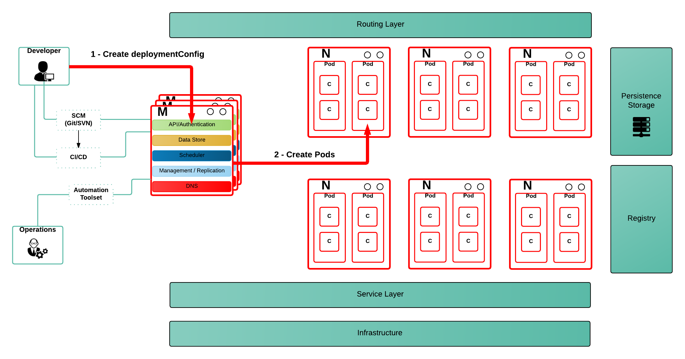

== Understanding Service Accounts and SCCs

We launched OpenShift 3.0 back in June 2015 and I have had the pleasure of speaking with users all over Europe and the EMEA region to help them get up and running with deploying applications on the platform. One of the features that developers and administrator often ask questions about are Service Accounts and Security Context Constraints. In this blog post, I will provide a simple introduction into both concepts, how they work and their usage.

=== Security Context Constraints (SCC)
The link:https://docs.openshift.org/latest/architecture/additional_concepts/authorization.html#security-context-constraints[official documentation states]:

____
OpenShift provides security context constraints (SCC) that control the actions that a pod can perform and what it has the ability to access.
____

In short, when we execute a container, we want to guarantee that the capabilities required by that container to run are satisfied, while at the same time we also want OpenShift to be a secure Container Application platform. For this reason we can not allow any container to get access to unnecessary capabilities or to run in an insecure way (e.g. privileged or as root).

OpenShift guarantees that the capabilities required by a container are granted to the user that executes the container at link:https://docs.openshift.org/latest/architecture/additional_concepts/authorization.html#admission[admission time]. Admission is done based on the identity of the user executing the pod and the pod’s service account.

The OpenShift Container Application Platform provides a set of predefined Security Context Constraints that can be used, modified or extended by any administrator. The capabilities that can be used are as follows:

----
$ oc get scc
NAME              PRIV   CAPS  HOSTDIR  SELINUX    RUNASUSER         FSGROUP   SUPGROUP  PRIORITY
anyuid            false  []    false    MustRunAs  RunAsAny          RunAsAny  RunAsAny  10
hostaccess        false  []    true     MustRunAs  MustRunAsRange    RunAsAny  RunAsAny  <none>
hostmount-anyuid  false  []    true     MustRunAs  RunAsAny          RunAsAny  RunAsAny  <none>
nonroot           false  []    false    MustRunAs  MustRunAsNonRoot  RunAsAny  RunAsAny  <none>
privileged        true   []    true     RunAsAny   RunAsAny          RunAsAny  RunAsAny  <none>
restricted        false  []    false    MustRunAs  MustRunAsRange    RunAsAny  RunAsAny  <none>
----

By default, the execution of any container will be granted the *restricted* SCC and only the capabilities defined by that SCC.

NOTE: SCC are Security Context Constraints as explained in the previous section.

----
$ oc describe scc restricted
Name:                restricted
Priority:               <none>
Access:
  Users:             <none>
  Groups:               system:authenticated
Settings:
  Allow Privileged:        false
  Default Add Capabilities:      <none>
  Required Drop Capabilities:    KILL,MKNOD,SYS_CHROOT,SETUID,SETGID
  Allowed Capabilities:       <none>
  Allowed Volume Types:       configMap,downwardAPI,emptyDir,persistentVolumeClaim,secret
  Allow Host Network:         false
  Allow Host Ports:        false
  Allow Host PID:          false
  Allow Host IPC:          false
  Read Only Root Filesystem:     false
  Run As User Strategy:             MustRunAsRange
    UID:             <none>
    UID Range Min:            <none>
    UID Range Max:            <none>
  SELinux Context Strategy:         MustRunAs
    User:               <none>
    Role:               <none>
    Type:               <none>
    Level:              <none>
  FSGroup Strategy:                 MustRunAs
    Ranges:             <none>
  Supplemental Groups Strategy:     RunAsAny
    Ranges:             <none>
----

As can be seen in the previous description of the *restricted* SCC, a list of users and groups can be specified. In order to grant a user or group a specific SCC, a cluster administrator can execute the following command:

----
$ oadm policy add-user-to-scc <scc_name> <user_name>
$ oadm policy add-group-to-scc <scc_name> <group_name>
----

=== Service Accounts
The link:https://docs.openshift.org/latest/dev_guide/service_accounts.html[official documentation states]:

____
When a person uses the command line or web console, their API token authenticates them to the OpenShift API. However, when a regular user’s credentials are not available, it is common for components to make API calls independently. For example:

* Replication controllers make API calls to create or delete pods
* Applications inside containers could make API calls for discovery purposes
* External applications could make API calls for monitoring or integration purposes

*Service accounts provide a flexible way to control API access without sharing a regular user’s credentials*.
____

As you can see, there are many use cases for Service Accounts, and if we dive into the first use case aforementioned, we need to understand that OpenShift (and Kubernetes) are not synchronous in the execution of their commands.

When a user wants to deploy a Pod, what actually happens under the covers is the creation of a DeploymentConfig resource definition that will be stored in *etcd* via the APIserver (in this sense, *etcd* is the configuration database for what should be existing inside OpenShift). This definition expresses a desired state by a user (as can be seen in the picture above as step 1). A set of controllers (admission, replication controller, scheduler,...), running on the master server, will then be monitoring these definitions stored in *etcd* and will execute the corresponding actions on the OpenShift platform in order to provide consistency between the desired and actual states (as can be seen in the picture above as step 2). This will happen as soon as the controllers try to consolidate the cluster state.

What this really means is that the actions taken are actually being executed by OpenShift controllers and not really by the actual user that expressed the desired state. This leads to the situation that we need to somehow identify who's executing the actions the controllers are doing.

By default, OpenShift uses 3 service accounts per project for executing the main 3 actions (building a pod, deploying a pod, and any other action) as can be read in link:https://docs.openshift.org/latest/dev_guide/service_accounts.html#default-service-accounts-and-roles[the official documentation].

When a user creates configuration objects in OpenShift it will, by default, use these default Service Accounts, but a different one can be specified within the configuration object itself.

----
{
   "kind": "DeploymentConfig",
   "apiVersion": "v1",
   "metadata": {...},
   "spec": {
      ...
      "template": {
         ...
         "spec":{
            "containers": [
            ],
            ...
            "serviceAccountName": "myserviceaccount"
         }
      }
   }
}
----

One reason to use a dedicated service account in a deployment configuration is to allow an application/process running within a pod access to use a set of privileges or capabilities other than those granted to the *default* service account. This default service account will only have access to all the capabilities defined by the *restricted* SCC.

As a service account is a regular user, it can be added to any specific SCC in a similar way as we have described previously.

This leads to the conclusion of this blog with my advice:

As an example, we might want to run an application that needs access to mount hostPath types of volumes, or we might want to run an application with a specified user and not a random user that OpenShift will use as default (as detailed in link:https://blog.openshift.com/getting-any-docker-image-running-in-your-own-openshift-cluster/[this blog]), or we might want to restrict the container's filesystem to be readonly, and forcing every write to be on external storage. There are many situations that might require us to change the capabilities provided by default.

“Every time you have an application/process that requires a capability not granted by the restricted SCC, create a specific service account, then add the service account to the appropriate SCC, but, if there is no SCC that perfectly suits your needs, instead of using the best fit one, link:https://docs.openshift.org/latest/admin_guide/manage_scc.html#creating-new-security-context-constraints[create a new SCC] tailored for your requirements, and finally set it for the deployment configuration (as described above).”

----
$ oc create serviceaccount useroot

$ oc patch dc/myAppNeedsRoot --patch '{"spec":{"template":{"spec":{"serviceAccountName": "useroot"}}}}'

$ oc adm policy add-scc-to-user anyuid -z useroot
----

Above you can see my advice in action, creating an new service account named __useroot__, modifying the deployment configuration for __myAppNeedsRoot__ and then adding the serviceaccount to the __anyuid__ SCC as the application defined needs to run as user root in the container.

NOTE: The previous example is using notation available in OpenShift Origin 1.1.4+ and OpenShift Enterprise 3.2+.

I’ve seen many users granting access to a user/serviceaccount to the privileged SCC to avoid going through this exercise, and this is can be a big security problem, so take my word of caution.
