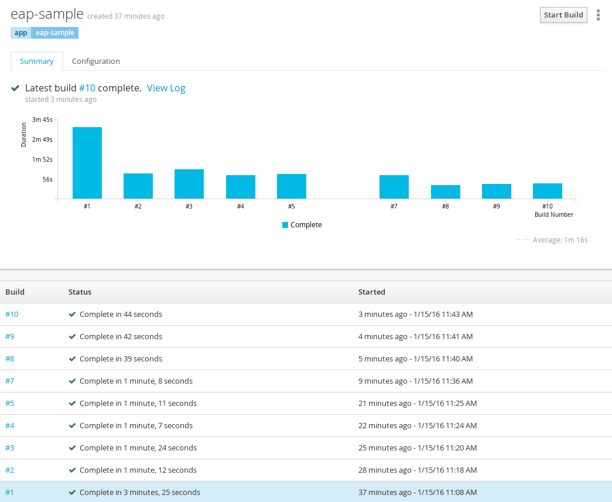

== Improving build time of Java builds on OpenShift
Since we released OpenShift 3 back in July 2015 one of the most common questions I get from developers is how to get better build time for Java based builds. In this post I will guide you into the process of
speeding up Java Maven based builds and will explain other options that can be taken to the ones that I'll be showing.

As you might know, OpenShift 3 Enterprise provides Middleware Services, which is a set of Java based images for JBoss EAP, JBoss EWS (Tomcat), JBoss Fuse Integration Services, JBoss A-MQ, JBoss Decision Server and JBoss Data Grid. Also, OpenShift Origin provides an additional JBoss based images for Wildfly, our application server community project. All these images are https://github.com/openshift/source-to-image/[source-to-image (S2I)] enable, that means that will get your application source code built and layered into the application container, and they rely on Maven for their building purposes. 

When working with Maven, it is very common to use a Central Artifact Repository Manager to your organization for centralizing and managing all the required and generated dependencies, as well as providing you with isolation from the real location of the artifacts in the Internet and some security mechanisms, amongst other features. During my life as a developer and consultant I've been working with Nexus Artifact Manager for this purpose. I will not say that it's the better or worse, but only that it is the one more familiar to me, and because of that, I will be using it in my OpenSHift install.

It is important to note that everything I will describe can be executed in OpenShift Enterprise or Origin, the only requirement is that if you're using the xPaaS images you should have the corresponding subscriptions for running them.

The first thing we need to do is to lay out our OpenShift architecture. I've decided to deploy Nexus as a service in OpenShift, so for that purpose I have created a https://github.com/jorgemoralespou/nexus-ose/tree/master/nexus/nexus-container[Nexus image] (not supported) that I will be building and deploying internally in my OpenShift instance, in a project for Continuous Integration tools, a projects that I've called *ci*. (This project name is important, but you I will explain later why).

----
$ oc new-project ci --display-name="Continuous Integration for OpenShift" --description="This project holds all continuous integration required infrastructure, like Nexus, Jenkins,..."

$ oc create -f https://raw.githubusercontent.com/jorgemoralespou/nexus-ose/master/nexus/ose3/nexus-resources.json -n ci
----  

The steps above will create a project called *ci*, and it will add some OpenShift resources to the project. These resources are:

* A nexus https://github.com/jorgemoralespou/nexus-ose/blob/master/nexus/ose3/nexus-resources.json#L8-L15[*ServiceAccount*] for using to build 
* A https://github.com/jorgemoralespou/nexus-ose/blob/master/nexus/ose3/nexus-resources.json#L16-L69[*BuildConfig*] for building the Nexus image, based on Centos7, and that will be published into a *nexus* ImageStream. When the BuildConfig gets deployed, a nexus build will be triggered. 

The build will take some time, so *be patient!!!*.

image:images/nexus_build.png[Nexus build]

* Both https://github.com/jorgemoralespou/nexus-ose/blob/master/nexus/ose3/nexus-resources.json#L70-L80[centos7] and https://github.com/jorgemoralespou/nexus-ose/blob/master/nexus/ose3/nexus-resources.json#L81-L96[nexus] *ImageStream* definitions

image:images/nexus_imagestreams.png[ImagesStreams]

* Two *Template*`s called https://github.com/jorgemoralespou/nexus-ose/blob/master/nexus/ose3/nexus-resources.json#L97-L291[nexus-ephemeral] and https://github.com/jorgemoralespou/nexus-ose/blob/master/nexus/ose3/nexus-resources.json#L292-L511[nexus-persistent]. 

The templates that are provided as part of the loaded resources will allow you to deploy an instance of the Nexus image built, using the nexus ServiceAccount, and configured to have a service on port 8081 and a route on whatever hostname you decide, for external access. Also, these templates will allow you to have a persistent instance of Nexus, using a https://docs.openshift.org/latest/dev_guide/volumes.html[PersistentVolume] or working in an ephemeral mode, where if the nexus replica dies, you'll lose all of your cached dependencies. For testing purposes, it's much easier to setup the ephemeral instance, but for a more real usage, you should consider only the persistent image.

There is full instructions on how to set the persistent volume and all the requirements in the https://github.com/jorgemoralespou/nexus-ose[README file in the Github repository]

In this example, I will deploy the ephemeral version, with the following command:

----
oc new-app --template=nexus-ephemeral --param=APPLICATION_HOSTNAME=nexus.apps.10.2.2.2.xip.io 
----

You can also deploy your nexus instance using the OpenShift console:

image:images/nexus_template_instance.png[Create a nexus instance]

It is very important to understand that the nexus instance will not be deployed until the build process has finished, and this can take quite some time, so *be patient!!!*.

NOTE: The value provided to APPLICATION_HOSTNAME is dependant on your installation. My OpenShift environment default application domain is apps.10.2.2.2.xip.io

We can access our nexus instance in the *APPLICATION_HOSTNAME* value we have provided and check what repositories are in there. Default credentials for this nexus instance are (*admin/admin123*). It is important to note that this Nexus server comes already configured with some Red Hat JBoss repositories, to allow our S2I images to fetch the appropriate dependencies.

image:images/nexus_console.png[Repository view]

What we need now is a way of instructing our JBoss S2I builder images to use this nexus instance as artifact repository manager. There is some alternatives to this, of which I will show 2 of them. 

== Using the provided S2I builder
JBoss EAP S2I Builder Image version 1.2, which is the latest version of the builder image, that comes with OpenShift Enterprise 3.1, provides an ENV variable that can be set to point to a *MAVEN_MIRROR_URL*. I will use that ENV variable to get the maven artifacts through our Nexus instance.

To check that our builds will use our internal nexus instance, we can browse to the public group page and verify that there is no dependency currently stored.

image:images/repo_empty.png[Empty group]

Let's create a new project and create a sample application using nexus.

----
$ oc new-project eap-nexus-builds --display-name="EAP builds with Nexus" --description="Building Applications in EAP using Nexus for dependency management"
----

For the application, we will be using the EAP S2I Builder image, and we will use the default sample project, and we will set a build ENV for MAVEN_MIRROR_URL. 

You should notice that I've used the internal DNS name of our nexus instance, which is *nexus.ci.svc.cluster.local*. This is a very powerful feature of OpenShift that provides DNS names for every service, https://docs.openshift.org/latest/architecture/additional_concepts/networking.html#openshift-dns[and much more]. 

When building the application, we will notice that maven dependencies are being pulled from our nexus instance, instead than the default public Red Hat JBoss' repositories.

image:images/eap_app_build.png[EAP Builds]

Once our build is finished, we will also see how our nexus repository artifact group is filled with all the dependencies that have been pulled down.

image:images/repo_full.png[Dependencies in repo]

And we will have our application running.

This first build took *1 minute and 47 seconds* as it was not using Nexus for caching dependencies. 

In the second build, I updated the BuildConfig to set an ENV for MAVEN_MIRROR_URL, and this build took *2 minutes and 49 seconds*, probably due to Nexus introducing some overhead. 

On the third and fourth build, all the dependencies were already cached in Nexus and build time dropped to *47 and 49 seconds*. 

As can be seen, there is a big impact on using an artifact repository manager for improving the build time of Java based applications.

== Modifying the S2I builder
As there might be some S2I builder images that does not expose the ability to set a Maven mirror, like the xPaaS images do, you need to think of other mechanisms to integrate these images with an artifact repository manager.

The options can vary, being the most obvious, modify or extend the builder image. As I do not like to modify existing images that are not crafted by me, I will show now how to extend the Wildfly S2I Builder images to make use of a Nexus artifact repository manager. This same approach can be used with any other image and some other technologies that uses or can benefit from the use of an artifact repository manager, as Nexus or Artifactory supports storing dependencies for more languages than just java. Also, if you use gradle you can benefit from an artifact repository manager in the same way.

I have provided with a file that will install all the required resources needed to work with the Nexus instance provided in the OpenShift install. These resources are:
repo_fu
* 3 *BuildConfigs*, one for https://github.com/jorgemoralespou/nexus-ose/blob/master/builders/wildfly-nexus/wildfly-nexus-resources.json#L8-L58[Wildfly 8], another one for https://github.com/jorgemoralespou/nexus-ose/blob/master/builders/wildfly-nexus/wildfly-nexus-resources.json#L59-L109[Wildfly 9] and the last one for https://github.com/jorgemoralespou/nexus-ose/blob/master/builders/wildfly-nexus/wildfly-nexus-resources.json#L110-L160[Wildfly 10].
* 6 *ImageStreams*, one for each of the original ImageStreams for every Wildfly version (https://github.com/jorgemoralespou/nexus-ose/blob/master/builders/wildfly-nexus/wildfly-nexus-resources.json#L110-L160[8], https://github.com/jorgemoralespou/nexus-ose/blob/master/builders/wildfly-nexus/wildfly-nexus-resources.json#L110-L160[9] and https://github.com/jorgemoralespou/nexus-ose/blob/master/builders/wildfly-nexus/wildfly-nexus-resources.json#L228-L260[10]) and another one for each of the created S2I builder images for Wildfly integrated with nexus (https://github.com/jorgemoralespou/nexus-ose/blob/master/builders/wildfly-nexus/wildfly-nexus-resources.json#L261-L283[8], https://github.com/jorgemoralespou/nexus-ose/blob/master/builders/wildfly-nexus/wildfly-nexus-resources.json#L284-L305[9] and https://github.com/jorgemoralespou/nexus-ose/blob/master/builders/wildfly-nexus/wildfly-nexus-resources.json#L306-L327[10]).

To install the Wildfly version:

----
$ oc new-project wildfly-nexus-builds --display-name="Wildfly builds with Nexus" --description="Building Applications in Wildfly using Nexus for dependency management"

$ oc create -f https://raw.githubusercontent.com/jorgemoralespou/nexus-ose/master/builders/wildfly-nexus/wildfly-nexus-resources.json
----

Once we have our custom Wildfly S2I images built,

image:images/wildfly-nexus-builds.png[Builds]

we can just create a sample application with them.

----
$ oc new-app --docker-image=wildfly-nexus-9 --strategy=source --code=https://github.com/bparees/openshift-jee-sample.git --name='wildfly-nexus-sample'
----

Here, we see as well that our build process is fetching the required maven dependencies from the provided Nexus artifact repository manager.

image:images/wildfly_builds.png[Builds]

This first build took *3 minutes and 11 seconds* as it was building with the plain wildfly-9 image available in Github, and also had to pull down the image. This image was not doing any dependency management.

In the second build, I updated the BuildConfig to use wildfly-nexus-9 builder image and this build took *1 minutes and 24 seconds*. On this run, Nexus was caching all the dependencies, as I used a clean nexus instance. 

On the third and fourth build, all the dependencies were already cached in Nexus and build time dropped to *37 and 35 seconds*. 

As can be seen, there is a big impact on using an artifact repository manager for improving the build time of Java based applications.

== Using incremental build
Another option that we have to improve Maven based Java builds in OpenShift is to enable the https://docs.openshift.com/enterprise/3.1/dev_guide/builds.html#incremental-builds[incremental builds], available in certain images by providing a https://docs.openshift.com/enterprise/3.1/creating_images/s2i.html#s2i-scripts[save-artifacts] script. What this incremental builds will do is to store all the pulled down dependencies in an archived file in the image itself, so that when a new build is triggered, the build process will restore the dependencies from the archived file and do a build. This will have the same behavior as having a local maven repository into the build image itself with the drawback of storing these artifacts in the image being built, and incurring into some image size penalty.

To test this mode, I have created a https://raw.githubusercontent.com/jorgemoralespou/nexus-ose/master/other/eap-incremental/eap-incremental-resources.json[sample resources file] that can be easily tested. 

----
$ oc new-project eap-incremental-builds --display-name="EAP incremental builds" --description="Building Applications in EAP using incremental build mode"

$ oc create -f https://raw.githubusercontent.com/jorgemoralespou/nexus-ose/master/other/eap-incremental/eap-incremental-resources.json
----

After we've created the resources, let's do some builds and look at the times.

image:images/eap_incremental_build.png[EAP incremental build]

As can be seen in the image above, the times for the second and third build, which are the builds benefiting from the stored artifacts takes much less time, *48 and 47 seconds*, but it's the same time it takes when using the artifact repository manager, so there is no additional benefit in time, although it is much simpler for those images that support incremental mode, as the developer will only need to specify https://github.com/jorgemoralespou/nexus-ose/blob/master/other/eap-incremental/eap-incremental-resources.json#L57[a flag in the BuildConfig].

The main difference is that the first step in the build process is to extract the archived dependencies.

image:images/eap_incremental_build_log.png[EAP incremental buildlog]

In this example, the application and pulled down dependencies are not adding a big overhead in size to the initial eap64-openshift S2I image, only 7 MB.

But we need to be careful with this approach as there are other images or applications that will have much more dependencies, and the size of the generated image can grow enormously. 130 MB in the following example using Fuse Integration Services.

image:images/fis_image_sizes.png[FIS incremental build]

== Summary
For every application that we build we will be getting a performance benefit by caching into an artifact repository manager it's dependencies. Initially we will be perceiving a performance benefit for the second and subsequent builds of every application, but as the artifact repository manager stores more and more dependencies this benefit will be also seen in initial builds of new applications, and most of the dependencies will already be cached.

Also, we can use incremental builds to get better performance on Java based builds, but it is important to understand that even this approach is easier to set up there are some drawbacks for this approach, like the need for the image to support incremental mode and a bigger image size. 

In this blog, I've highlighted how we can improve the build time of Maven based Java builds in OpenShift, but also a very important topic is the use of the internal DNS service names to reference from one project to another. The only caveat to this, is that if we are using the multi-tenant OVS networking plugin, our cluster administrators will have to make visible our *ci* project to all other projects:

----
$ oadm pod-network make-projects-global ci 
---- 
