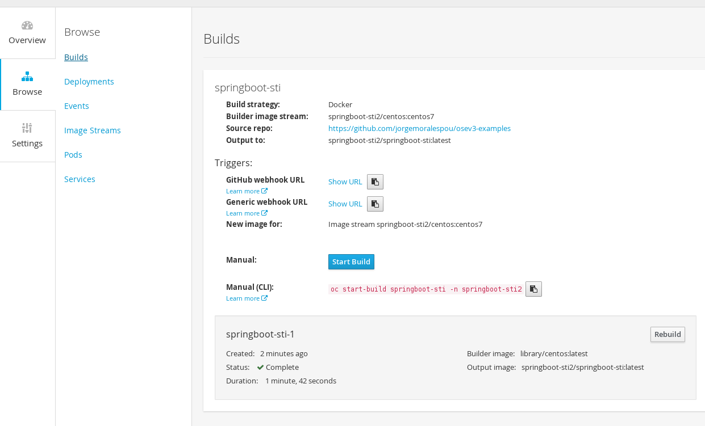
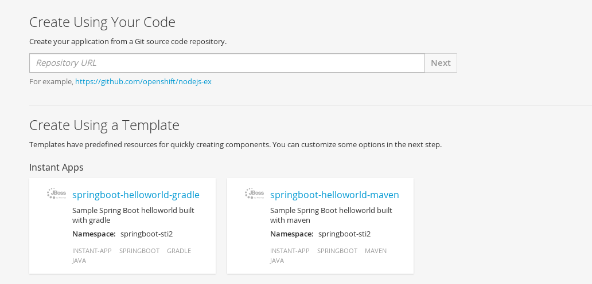
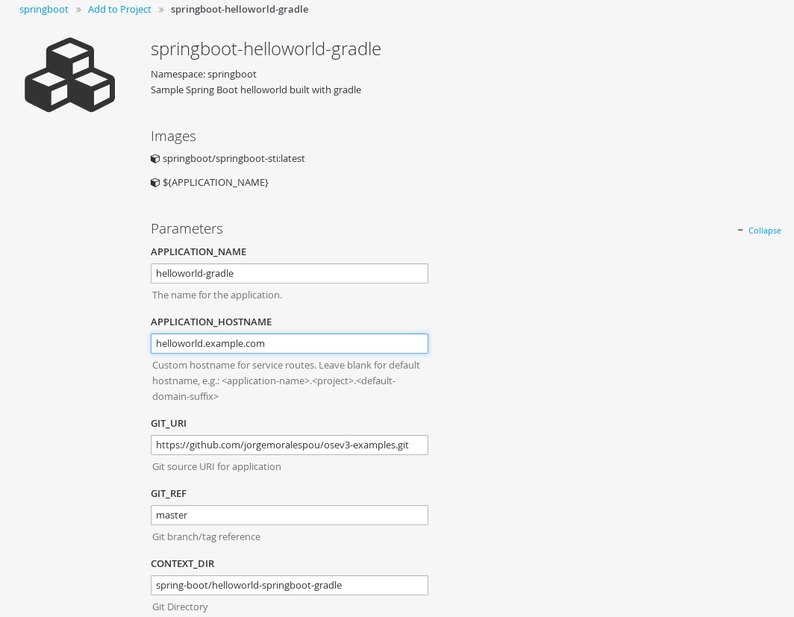
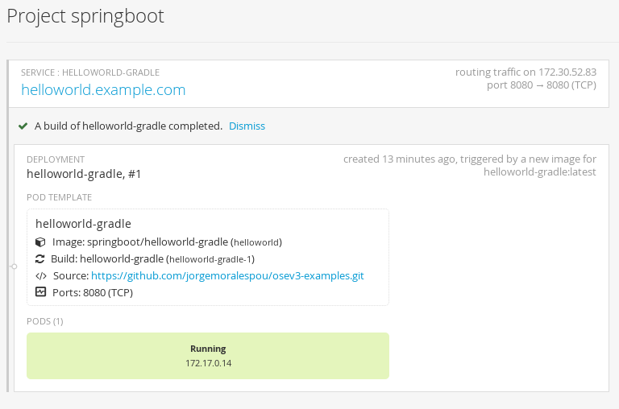
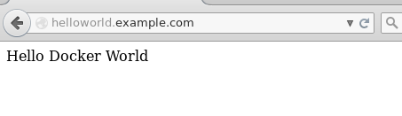
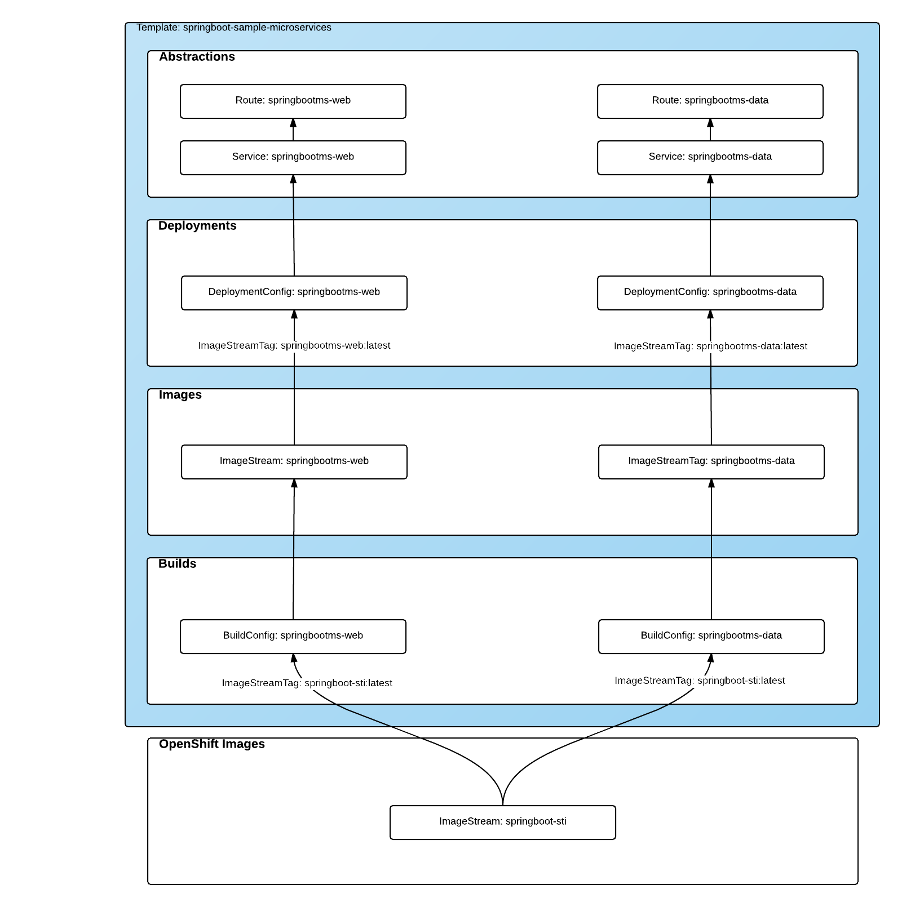
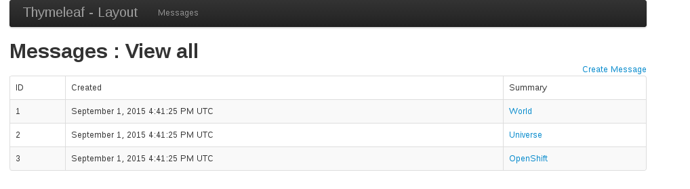

= Using OpenShift for Enterprise Grade Spring Boot Deployments

We live in a polyglot world where developers are using a vast array of different technologies to create applications that perform well, while also having the ability to scale to meet the demands of their application users. Of course, it is very easy to show the supported languages and runtimes that OpenShift provides out of the box, but to be realistic, many developers would like to see how we can bring other leading technologies into OpenShift and use them seamlessly. We built OpenShift 3 around Docker to embrace a standard container runtime and packaging format and give OpenShift developers access to the huge ecosystem of Docker-packaged software stacks. Kubernetes then adds web scale orchestration to OpenShift, which is critical for deploying complex microservices that span multiple containers across multiples hosts. As a result, the ability to run virtually any runtime or framework on the OpenShift platform is now a reality.

Today, I’ve decided to create an application (to be more precise a set of microservices) using the popular Spring Boot technology and deploy it on OpenShift 3. In this post, I’m going to walk you through all of the steps required, as well as provide the source code so you can see it in action by yourself and customize/extend it to your needs.

This is a summary of what I’m going to show:

* Creating a Source-to-Image (S2I) builder image for Spring Boot based applications
* Deploying a sample set of applications developed with Spring Boot

Let’s get our hands dirty and start playing with some of this technology.

== Spring Boot S2I Builder
Spring Boot applications are really very similar in structure to any other Java application. The main difference, apart from the libraries you use, is that it will pack everything as a single fat jar that will be run directly by the JVM. All of the runtime, libraries, dependencies and code will be embedded into this single jar file.

OpenShift S2I automatically generates a new Docker image for deployment, using source code provided by the developer and a corresponding Docker builder image in OpenShift. I used what https://twitter.com/soltysh[_Maciej Szulik_] showed in his https://blog.openshift.com/create-s2i-builder-image/[How to Create an S2I Builder Image] blog post. Also, I used the https://github.com/openshift/sti-wildfly[openshift/wildfly-81-centos7] image as a source of inspiration.

I created an S2I project, and modified the Dockerfile:

* Installed all the binaries I needed. In this case I installed *java 8*, *maven 3.3.3* and *gradle 2.6* on top of the *openshift/base-centos7* base image
* Modified all the labels describing the S2I image

You may want to take a few minutes and examine the https://github.com/jorgemoralespou/osev3-examples/blob/master/spring-boot/springboot-sti/Dockerfile[Dockerfile] in more detail.

The next step in the process of getting a Spring Boot application running on OpenShift 3 is to build/generate the artifact (fat jar file) and place it into a “known” location where the image expects to find it. In order to accomplish this, we need to modify the assemble script that we are using as a base from the wildfly image.  This scripts needs to be modified to have the following capabilities:

* Ability to build with maven and gradle. Maven takes precedence if there is a pom.xml against having a build.gradle file
* Make configurable the options to both builders via and ENV named BUILDER_ARGS with some appropriate defaults
* Place the generated artifact in a known location (/opt/openshift/app.jar)

You may want to take a few minutes and review the modified https://github.com/jorgemoralespou/osev3-examples/blob/master/spring-boot/springboot-sti/.sti/bin/assemble[assemble] script to ensure you understand all of the changes.

And finally, I modified the S2I run script to run the Spring Boot application, with the following changes:

* Execution of the generated artifact in the known location
* Being able to pass application parameters via an ENV named APP_OPTIONS

You may want to look in greater detail the S2I https://github.com/jorgemoralespou/osev3-examples/blob/master/spring-boot/springboot-sti/.sti/bin/run[run] script.

Then, following instructions on https://blog.openshift.com/create-s2i-builder-image/[Maciej's blog post], I created a test application (really two, one for maven building and one for gradle), and tested everything via using the generated Makefile.

*Great!!! Now it is time to add this S2I Builder to OpenShift 3.*

At this step you can take two approaches (with some variations). Publish your builder on Docker Hub, or just make your builder available in OpenShift.. 

Now, in order to do the latter, in a new project we need to:

* Create an ImageStream. An ImageStream is identified as having builder images if it has a https://github.com/jorgemoralespou/osev3-examples/blob/master/spring-boot/springboot-sti/springboot-sti-all.json#L83[builder tag] in it’s definition. 
* Create a BuildConfig using my GitHub project as source and the builder ImageStream as output.

You may want to see the https://github.com/jorgemoralespou/osev3-examples/blob/master/spring-boot/springboot-sti/springboot-sti-all.json[OpenShift resources definition].

To have the Spring Boot builder working on your OpenShift 3 installation, follow these simple steps:

----
$ oc new-project springboot-sti
$ oc create -f https://raw.githubusercontent.com/jorgemoralespou/osev3-examples/master/spring-boot/springboot-sti/springboot-sti-all.json
----

I have also provided two sample instant-app templates for demonstrating usage of the builder. This is a helloworld Spring Boot sample application available in my GitHub that will be built using maven or gradle depending on the instant-app you select.

You can monitor the building process for this springboot-sti image. Once the build is done, and the image is pushed into the internal docker registry in OpenShift, it is ready for use.

You can use one of the quickstart templates:

Provide it with required information (application name and hostname):

And create the application. 

Once your application is running, you can visit it’s URL to see it in action.

== A more interesting Spring Boot application
So far, we have a running Spring Boot application. But the question is, will I be able to build and run more complex applications? Of course you can!  

I created a more complex sample Spring Boot application, consisting of a web application and a messages service that stores information in memory.To keep things simple, I used the samples provided with Spring Boot distribution as source and modified two of them to allow interaction across the two samples. So our web application will be a frontend for our messages service. The web service will interact with the messages service via a Rest API.

I will use the same approach I did before, on https://blog.openshift.com/part-2-creating-a-template-a-technical-walkthrough/[Part 2] of my templates blog to show all the OpenShift resources that I will be creating. I will package everything as an https://github.com/jorgemoralespou/osev3-examples/blob/master/spring-boot/sample-microservices-springboot/ose-instantapp-template.json[instant-app template], so it can be seen in action in an easy way.

To run it you will just need to load the instant-app, and instantiate it. Of course, you will need to adjust the parameters when creating your template. The required parameters are APPLICATION_NAME for the name of the application, APPLICATION_HOSTNAME will be the external DNS name where the web will be listening and APPLICATION_HOSTNAME_DATA will be the external DNS name for the Rest Endpoint for the data service.

----
$ oc create -f https://raw.githubusercontent.com/jorgemoralespou/osev3-examples/master/spring-boot/sample-microservices-springboot/ose-instantapp-template.json
$ oc new-app --template=springboot-sample-microservices -p APPLICATION_NAME=springbootms,APPLICATION_HOSTNAME=web.example.com,APPLICATION_HOSTNAME_DATA=data.example.com
----

This sample application will create a web component that will look like this:

And a data services, that can be queried using Rest, like this:

----
$  curl http://data.example.com/
[{"id":1,"text":"Hello","summary":"World","created":1441125685591},{"id":2,"text":"Hi","summary":"Universe","created":1441125685594},{"id":3,"text":"Hola","summary":"OpenShift","created":1441125685594}]
----

----
$ curl  -H "Content-type: application/json" -X POST -d '{"id":10,"text":"aaaaa","summary":"bbbbb"}'  http://data.example.com:1080
{"id":10,"text":"aaaaa","summary":"bbbbb","created":1441126793364}
----

----
$  curl http://data.example.com/
[{"id":1,"text":"Hello","summary":"World","created":1441125685591},{"id":2,"text":"Hi","summary":"Universe","created":1441125685594},{"id":3,"text":"Hola","summary":"OpenShift","created":1441125685594},{"id":10,"text":"aaaaa","summary":"bbbbb","created":1441126793364}]
----

Looking at the logs of both pods, you will be able to see the output of your running Spring Boot applications.

Let’s first identify our pods. These will be the pods in Running state, with names starting with springbootms-data and springbootms-web:

----
$ oc get pods
NAME                        READY     STATUS       RESTARTS   AGE
springboot-sti-1-build      0/1       ExitCode:0   0          48m
springbootms-data-1-1093k   1/1       Running      0          24m
springbootms-data-1-build   0/1       ExitCode:0   0          28m
springbootms-web-1-37xi2    1/1       Running      0          24m
springbootms-web-1-build    0/1       ExitCode:0   0          28m
----

This is similar to what you will see if you tail the log for the data service:

----
$ oc logs springbootms-data-1-1093k
2015-09-01 16:41:28.019  INFO 1 --- [           main] o.s.j.e.a.AnnotationMBeanExporter        : Registering beans for JMX exposure on startup
2015-09-01 16:41:28.031  INFO 1 --- [           main] o.s.c.support.DefaultLifecycleProcessor  : Starting beans in phase 0
2015-09-01 16:41:28.239  INFO 1 --- [           main] s.b.c.e.t.TomcatEmbeddedServletContainer : Tomcat started on port(s): 8080 (http)
2015-09-01 16:41:28.241  INFO 1 --- [           main] c.o.e.m.r.InMemoryRepositoryApplication  : Started InMemoryRepositoryApplication in 19.117 seconds (JVM running for 20.961)
2015-09-01 16:55:36.809  INFO 1 --- [nio-8080-exec-4] o.a.c.c.C.[Tomcat].[localhost].[/]       : Initializing Spring FrameworkServlet 'dispatcherServlet'
2015-09-01 16:55:36.809  INFO 1 --- [nio-8080-exec-4] o.s.web.servlet.DispatcherServlet        : FrameworkServlet 'dispatcherServlet': initialization started
2015-09-01 16:55:36.836  INFO 1 --- [nio-8080-exec-4] o.s.web.servlet.DispatcherServlet        : FrameworkServlet 'dispatcherServlet': initialization completed in 27 ms
----

And this is the content available in the tailed log for the web service:

----
$ oc logs springbootms-web-1-37xi2
2015-09-01 16:41:27.410  INFO 1 --- [           main] o.s.j.e.a.AnnotationMBeanExporter        : Registering beans for JMX exposure on startup
2015-09-01 16:41:27.693  INFO 1 --- [           main] s.b.c.e.t.TomcatEmbeddedServletContainer : Tomcat started on port(s): 8080 (http)
2015-09-01 16:41:27.703  INFO 1 --- [           main] c.o.e.m.web.SampleWebUIApplication       : Started SampleWebUIApplication in 17.639 seconds (JVM running for 20.512)
2015-09-01 16:55:36.567  INFO 1 --- [nio-8080-exec-4] o.a.c.c.C.[Tomcat].[localhost].[/]       : Initializing Spring FrameworkServlet 'dispatcherServlet'
2015-09-01 16:55:36.568  INFO 1 --- [nio-8080-exec-4] o.s.web.servlet.DispatcherServlet        : FrameworkServlet 'dispatcherServlet': initialization started
2015-09-01 16:55:36.594  INFO 1 --- [nio-8080-exec-4] o.s.web.servlet.DispatcherServlet        : FrameworkServlet 'dispatcherServlet': initialization completed in 26 ms
----

As we have seen, our sample Spring Boot services application are running fine using our Spring Boot S2I builder image.

I hope you have enjoyed!!!
